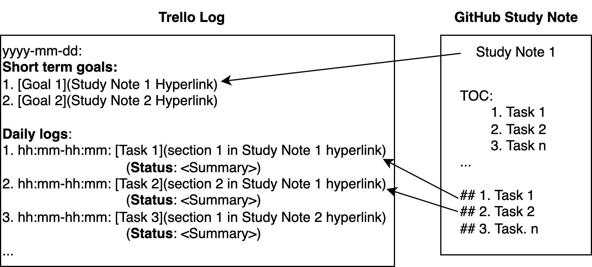

# Daily Plans and Logs

> [!NOTE]
> **Lab Hours**: `09:00` to `17:00` every working day.

> [!CAUTION]
> Do not take any action before planning, it will waste our time.

## Table of Contents

- [Daily Plans and Logs](#daily-plans-and-logs)
  - [Table of Contents](#table-of-contents)
  - [Purpose](#purpose)
  - [Create Daily-log Card](#create-daily-log-card)
  - [Writing Daily-log](#writing-daily-log)
    - [Formatting Standards](#formatting-standards)
    - [Auto Daily-log](#auto-daily-log)
      - [Generating the Daily-Log Entry](#generating-the-daily-log-entry)

## Purpose

This document describes how students track daily progress and ensure systematic completion of project milestones through two essential documents:

1. **Milestones** (`milestones.md`): Project roadmap with all tasks, deadlines, and completion status
2. **Daily Logs** (`daily-logs.md`): Time-stamped record of work performed, linking tasks to study notes


## Create Daily-log Card

1. Get access to our GitHub Projects ([lab-members](https://github.com/orgs/bmw-ece-ntust/projects/8) / [interns](https://github.com/orgs/bmw-ntust-internship/projects/4)) (contact our GitHub admin).
2. Create your card based on the daily-log card template.
3. Write the information below as the **GitHub Project card description** in the first comment of the card. The card description serves as the student's permanent profile and milestone reference on the project board.

   **Example:**

    ```markdown
    **Profile Information**
    - Name: <Full Name>
    - Student ID: <Student ID>
    - Email: <ntust.edu.tw email>
    - Supervisor: Prof. Ray

    **Projects**
    1. Thesis: [<Thesis Title>](<GitHub repo link>)
    2. Industrial Project: [<Project Name>](<GitHub repo link>)
    3. Logistic Jobs: <e.g., Meeting administrator>

    **Milestones**
    - [ ] [<Milestone 1 Title>](<GitHub link>)
    - [ ] [<Milestone 2 Title>](<GitHub link>)
    ```

## Writing Daily-log

### Formatting Standards

```markdown
### yyyy/mm/dd

**Reviewed by**: <GitHub username>

**Short-term Goal**

- [x] [owner/repo] [TA rApp refactoring](Documentation link with 7-digit commit hash)

**Daily-logs**:

- `hh:mm - hh:mm` [owner/repo]: [Task 1 Title](Documentation header link with 7-digit commit hash)
- `hh:mm - hh:mm` [owner/repo]: [Task 2 Title](Documentation header link with 7-digit commit hash)
- <Upcoming targets>
```

Each daily-log bullet is one session of work on one project. The `[owner/repo]` tag identifies the project the work belongs to: `owner` is the GitHub account that owns the repo (an organization such as `bmw-ece-ntust`, or a personal account), and `repo` is the repository name. Both the start and end time are required (`hh:mm - hh:mm`).

> [!IMPORTANT]
> **`Reviewed by: <GitHub username>` — human verification of LLM-written content.**
> When the daily-log is generated by an LLM (the auto daily-log below writes the entry for
> you), the entry is **not final** until a human checks it. Put your GitHub username on the
> `**Reviewed by**:` line under the date to certify that **you read the entry and confirm the
> activity, times, and links are accurate**. An entry with the placeholder still in it
> (`<GitHub username>`) is unreviewed — treat it as a draft. The auto daily-log tool inserts
> this line empty on every new day card precisely so it is never silently skipped.
> The same rule applies to **meeting minutes** and **documentation** produced via LLM
> (see [logistics/meeting.md](./logistics/meeting.md) and
> [project-documentation.md](./project-documentation.md)).

> [!NOTE]
> Tasks may overlap in time. With agentic AI, several tasks can run concurrently, so overlapping `hh:mm - hh:mm` ranges across different `[owner/repo]` projects are expected and allowed. Log each task on its own bullet with its own start and end time.

Example:

```markdown
### 2026/04/22

**Short-term Goal**

- [x] [bmw-ece-ntust/nonrtric-rapp-test-automation] [TA rApp refactoring](https://github.com/bmw-ece-ntust/nonrtric-rapp-test-automation/tree/7bd313d#test-automation-rapp)

**Daily-logs**:

- `09:00 - 10:30` [bmw-ece-ntust/nonrtric-rapp-test-automation]: [Rebuild and Deploy TA rApp](https://github.com/bmw-ece-ntust/nonrtric-rapp-test-automation/tree/7bd313d#-rebuild--deploy-ta-rapp)
- `10:00 - 12:00` [bmw-ece-ntust/nonrtric-rapp-test-automation]: [Upload Test Spec](https://github.com/bmw-ece-ntust/nonrtric-rapp-test-automation/tree/7bd313d#-upload-test-specification-to-ta-rapp---test-spec-info)
- `10:30 - 11:15` [ijosh-ch/daily-log]: [Fix bullet time-range parser](https://github.com/ijosh-ch/daily-log/tree/abc1234#dailylog-md)
- <Upcoming targets>
```

> [!TIP]
> Link study notes with milestones and daily logs as shown below:



**Key Principles**:

- One project = One markdown file ([integration/user guide](./integration-guide.md) OR [project documentation](./project-documentation.md))
- Hourly task = One section (markdown header) in the study note
  - Task title = section header (## in the documentation)
- One bullet = One session of work on one project. Tag every bullet with its `[owner/repo]` project so activities stay grouped per project.
- Students log each task immediately after completion.
- Students include accurate start and end times for each task (`hh:mm - hh:mm`). Tasks may overlap because agentic AI runs tasks concurrently.
- Students specify which project to work on as their daily short-term goal, tagged with `[owner/repo]`.

> [!WARNING]
>
> Each finished task must be linked to a documentation header link (**with 7-digit commit hash**) in the markdown file.
>
> The 7-digit commit hash ensures **the link is always available**, even if the document is renamed/moved.

**How to get the commit hash URL:**

1. Open the documentation in GitHub from the commit history (the 7-digit hash appears in the browser URL).
2. Click the designated section header link.
3. Copy the URL. Use either the full URL or shorten it to keep only the 7-digit commit hash.

### Auto Daily-log

Students commit all activity to the lab's GitHub Organizations or Prof. Ray's repositories using the prompt below. In Claude Code, this prompt is triggered automatically when you type `git push` via a `UserPromptSubmit` hook.

> [!NOTE]
> Per-repo session activity is also recorded in the lab long-term memory (LTM): a SessionStart hook writes one `activity` row per repo per day and one `worklog` row per session with exact start/end timestamps. Each row keeps `owner` (the GitHub account, org or personal) and `repo` (name only) as separate fields, so daily-log bullets can be reconstructed per project across machines. Recall them with the `memory` skill (recall-by-repo). See [lab-automation/llm-memory.md](./lab-automation/llm-memory.md).

```markdown
Reconcile all 4 project memory files with the current state of the repository, then commit and push.

### Reconcile the 4 project memory files

These four files at the repo root are the single source of truth for the project. Reconcile each before committing:

- **AGENTS.md / CLAUDE.md** — the static knowledge snapshot. `AGENTS.md` is the tool-neutral base (rules, conventions, file list); `CLAUDE.md` is the tool adapter that defers to it. Update the file list (add new files, fix renamed or deleted entries), terminology, conventions, and external links. Never log session activity or prompting history here.
- **CONTEXT.md** — the living architecture overview. Update the architecture summary, the key files map, external services, and environment notes to match the current repo state.
- **MEMORY.md** — the append-only session log. Append one new dated entry; never edit past entries. Use the form: `### yyyy/mm/dd — [7-digit hash] "<commit title>"`, then `**Duration**: <working hour>` and `**Summary**: <one paragraph>`.
- **TODO.md** — the task backlog. Mark completed items `[x]`, remove stale tasks, add any new tasks uncovered this session, and re-prioritize under **Now / Next / Later**.

### Determine the working hour (per day, from the LTM)

All times are Asia/Taipei (GMT+8). A single push often covers work done across several days, so reconstruct the hours and activities **per day** from the long-term memory (LTM), not from the commit date.

1. Run `git log -1 --format="%H %ai"` for the last commit hash and timestamp (the session-start boundary), and `date "+%Y/%m/%d %H:%M"` for the session end (now).
2. From the LTM, read this repo's `worklog` rows (exact start/end per session) and `activity` rows dated after the last commit, using the `memory` skill (recall-by-repo on `owner` + `repo`). Group them by calendar day.
3. For each day: sum the session durations to get that day's hours, and distil that day's session descriptions into a short activity summary. Cross-check the earliest session against the transcript at `{{VSCODE_TARGET_SESSION_LOG}}`. If both the transcript and the LTM are unavailable, ask *"What time did you start working today?"*. Never invent the time.
4. Write the working hour in the commit body, one line per day:
   - **Single day** collapses to one line: `work duration: yyyy/mm/dd_hh:mm - hh:mm`.
   - **Multiple days** list each day with its range, hours, and activities from the LTM (see the format below).

### Commit and push

1. Write a one-paragraph summary of what was accomplished across the whole span.
2. Remove any LLM from the co-author list.
3. Stage the changed files by name (AGENTS.md/CLAUDE.md, CONTEXT.md, MEMORY.md, TODO.md, plus any others touched); never `git add -A`. Then commit and push using this format (the `work duration` block has one line per day, sourced from the LTM):

---

<Short imperative summary title>

work duration:
- yyyy/mm/dd_hh:mm - hh:mm (N.Nh): <what was done that day, from the LTM>
- yyyy/mm/dd_hh:mm - hh:mm (N.Nh): <what was done that day, from the LTM>

Summary:
<One-paragraph summary of what changed and why>

Details:
1. <Specific change 1>
2. <Specific change 2>
```

---

#### Generating the Daily-Log Entry

After committing, generate the daily-log card from the LTM, not from the commit date. For **each calendar day** the work spanned, create a `### yyyy/mm/dd` entry. Under it, group the sessions by `[owner/repo]` project, show that day's total hours per project, and list each session's time range and activity from the LTM `worklog`/`activity` rows. Parallel work across repos on the same day appears as separate per-project blocks, and overlapping time ranges are allowed. Attach the single multi-day commit link on **every day's block** as the evidence. Review and edit before posting to GitHub Projects.

Example (one multi-day push, worked in parallel on two repos):

```markdown
### 2026/06/18

**Daily-logs**:

- [bmw-ece-ntust/llm-skill-ltm] — 3.4h → [`a52ec61`](https://github.com/bmw-ece-ntust/llm-skill-ltm/commit/a52ec61)
  - `14:07 - 15:30` Split owner/repo across record-session and backfill
  - `16:10 - 18:00` Update memory skill recall-by-repo
- [ijosh-ch/some-repo] — 1.0h → [`a52ec61`](https://github.com/bmw-ece-ntust/llm-skill-ltm/commit/a52ec61)
  - `15:00 - 16:00` Reviewed PR feedback (parallel)

### 2026/06/19

**Daily-logs**:

- [bmw-ece-ntust/llm-skill-ltm] — 2.0h → [`a52ec61`](https://github.com/bmw-ece-ntust/llm-skill-ltm/commit/a52ec61)
  - `10:00 - 12:00` Reconcile the 4 files, finalize and push
```
