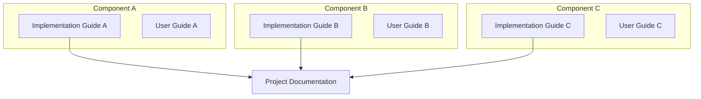

<h1 align="center">Implementation Guide — Guideline</h1>
<hr>

> [!CAUTION]
> Keep this document **private** by default. Make it public only after the project's paper is published. Request access from the group's GitHub admin.

---

> [!NOTE]
> **Implementation Guide vs User Guide vs Project Documentation**
>
> - **Implementation Guide** (this file): per-component **installation** (setup, configuration, dependencies) and **end-to-end integration** (connecting components, verifying interfaces). The single document for bringing the full system up from a clean state.
> - **User Guide**: how to **use** the system once it is running.
> - **Project Documentation**: `System Architecture` (with a link to this guide), use-case diagram, message-sequence chart (MSC), class diagram, flowchart.



## Table of Contents

> [!TIP]
> Generate the Table of Contents automatically with the [Markdown All in One extension for VS Code](https://marketplace.visualstudio.com/items?itemName=yzhang.markdown-all-in-one#table-of-contents).

- [Table of Contents](#table-of-contents)
- [How to Write This Guide](#how-to-write-this-guide)
  - [1. One command, one block — with concise output](#1-one-command-one-block--with-concise-output)
  - [2. Only the required steps, in the right order](#2-only-the-required-steps-in-the-right-order)
  - [3. Generate from the captured terminal log](#3-generate-from-the-captured-terminal-log)
  - [4. One-touch deployment (LLM over SSH)](#4-one-touch-deployment-llm-over-ssh)
- [Project Description](#project-description)
- [System Architecture](#system-architecture)
- [Execution Status](#execution-status)
- [Access Method](#access-method)
- [Repository Structure](#repository-structure)
  - [Configuration](#configuration)
  - [Installation Steps](#installation-steps)
- [End-to-End Walkthrough](#end-to-end-walkthrough)
- [Post-Installation Verification](#post-installation-verification)
- [Known Issues](#known-issues)
- [Troubleshooting](#troubleshooting)
- [Additional Resources](#additional-resources)

## How to Write This Guide

Four rules produce a guide a successor — human or LLM — can follow top-to-bottom to a working system.

### 1. One command, one block — with concise output

Put the command in a fenced block tagged with its shell, and comment the terminal output in the **same** block with `#`. Keep only the lines that prove the step succeeded or failed; skip the rest with `...`. Redirect long or noisy logs to a `./logs/` folder and link them.

```shell
git clone https://github.com/<org>/<repo>.git && cd <repo>

# Cloning into '<repo>'...
# ...
# Resolving deltas: 100% (42/42), done.
```

### 2. Only the required steps, in the right order

Document the **shortest successful path**: the commands that actually worked, on the critical path, runnable top-to-bottom from a clean state to a working system. Drop exploratory, repeated, and dead-end commands from the main flow. Put failures, wrong turns, and their fixes in [Known Issues](#known-issues) / [Troubleshooting](#troubleshooting) at the bottom, each as *symptom → cause → fix*.

### 3. Generate from the captured terminal log

Terminal activity is captured automatically by the lab terminal-logging system (`termlog` schema, managed by `bmw-ece-ntust/llm-skill-logging`; see [daily-log.md](./daily-log.md) and [lab-automation/llm-memory.md](./lab-automation/llm-memory.md)). Generate the guide **from that stored data**, not from memory — run the `/integration-guide` skill, which pulls the session's commands ordered on the shared UTC timestamp and renders each as a `shell` block with `#`-commented output per the rules above.

### 4. One-touch deployment (LLM over SSH)

> [!IMPORTANT]
> Structure the guide so an LLM can take a clean server to a working system over SSH: the human fills in the Prerequisites, the LLM runs one idempotent script, and it pauses only for the human-only steps you flag.

**Prerequisites — the human fills these in first.** List everything the LLM cannot invent. Keep secret *values* out of Git; list only their names and where they live.

| Input | What it is | Example |
| --- | --- | --- |
| SSH access | account with `sudo`, reachable over VPN | `user@<ip>` |
| Config values | ports, FQDN/IP, paths | `PORT=8200` |
| Secret pointers | secret name + location (Vault path, Keychain item) — never the value | `secret/lab/<proj>/db` |
| Certs / keys | TLS or SSH material the human provisions | `/etc/<svc>/tls/*` |
| Human-custody items | unseal keys, root tokens, OIDC secrets stored offline | held by key holders |

**One-touch script.** Provide a single idempotent script (for example `deploy/<component>-deploy.sh`) that performs the whole server-side bring-up, plus the one command that runs it:

```bash
scp -r deploy/<component>-deploy.sh config "$SSH_USER@$HOST:/tmp/dep/"
ssh "$SSH_USER@$HOST" "sudo VAR1=... VAR2=... bash /tmp/dep/<component>-deploy.sh"

# == step 1: install packages ... ==
# ...
# == done ==
```

- **Idempotent** — safe to re-run; each step checks state before acting (installed? enabled? configured?), so reruns converge instead of duplicating.
- **Reads inputs from the environment**, never hardcoded; **fails closed** with a clear message naming the missing input.
- **Human-only steps stay manual** — the script prints what the human must do (store unseal keys offline, approve access) and stops or continues safely.
- **Verifiable output** — each stage prints a success/failure marker so the LLM can confirm before proceeding.
- Keep a **Manual reference** (the same steps one at a time) below the one-touch path so the deployment can be audited or run by hand.

Worked example: `bmw-ece-ntust/llm-skill-creds/installation-guide.md` (Prerequisites → `deploy/deploy-vault.sh` → Manual reference).

## Project Description

**Project Name:** [Replace with actual project name]

**Description:** A solution for [specific use case] that provides [key functionality] and enables users to [main benefit].

**Key Features:**

- Feature 1: [Brief description]
- Feature 2: [Brief description]
- Feature 3: [Brief description]

**Target Users:** [Developers / Researchers / System Administrators / etc.]

## System Architecture

> [!NOTE]
> **draw.io files:** store raw `.drawio` files in `./docs/drawio/`, export PNG/SVG for embedding, version the raw files, and name them `<project-name>.drawio`.

Include in the architecture diagram:

1. **IP addresses** — per module/component
2. **Connection types & protocols** — WiFi, RJ-45, HTTP, TCP, UDP, WebSocket, etc.
3. **Sub-module structure** — internal components and their relationships
4. **Data-flow direction** — request/response patterns
5. **Port numbers** — communication ports
6. **Network boundaries** — segments (DMZ, internal, external)

## Execution Status

> [!NOTE]
> **Status icons:** ✅ done · ⏳ in progress / pending · ❌ error (with explanation)

| Step | Status | Timeline | Notes |
| --- | --- | --- | --- |
| [Install Component A](#installation-steps) | ✅ | 2024-10-15 | All services running |
| [Install Component B](#installation-steps) | ✅ | 2024-10-16 | Dependencies resolved |
| [Configure components](#configuration) | ✅ | 2024-10-17 | Environment variables set |
| [Integrate A ↔ B](#end-to-end-walkthrough) | ✅ | 2024-10-19 | Communication verified |
| [Post-installation verification](#post-installation-verification) | ✅ | 2024-10-20 | All checks passed |
| [Performance tuning](#troubleshooting) | ⏳ | 2024-10-21 | Tuning parameters |

## Access Method

> [!NOTE]
> Servers live in the server room. Contact the admin for VPN access.

```shell
Host: <IP address>
User: <username>
```

```shell
ssh user@<IP address>

# The authenticity of host '192.168.1.100' can't be established.
# Are you sure you want to continue connecting (yes/no/[fingerprint])? yes
# ...
# Welcome to Ubuntu 22.04.3 LTS (GNU/Linux 5.15.0-87-generic x86_64)
# user@hostname:~$
```

## Repository Structure

```markdown
project-name/
├── src/                   # Source code
│   ├── main.py            # Main application entry point
│   └── modules/           # Application modules
├── config/                # Configuration files
│   ├── .env.example       # Environment variables template
│   └── settings.json      # Application settings
├── deploy/                # One-touch deployment script(s)
├── docs/                  # Documentation
├── tests/                 # Test files
├── requirements.txt       # Dependencies
└── README.md              # Project overview
```

### Configuration

Create a `.env` file in the root directory (see `config/.env.example` for all variables):

```bash
# Database
DB_HOST=localhost
DB_PORT=5432
DB_NAME=your_database_name
DB_USER=your_username
DB_PASSWORD=your_password

# Application
APP_PORT=3000
APP_DEBUG=false
```

### Installation Steps

Run these from a clean checkout, top-to-bottom, to reach a running system.

1. **Clone the repository:**

    ```sh
    git clone https://github.com/<org>/<repo>.git && cd <repo>

    # Cloning into '<repo>'...
    # ...
    # Resolving deltas: 100% (42/42), done.
    ```

2. **Install dependencies:**

    ```sh
    pip install -r requirements.txt

    # Collecting package-name==1.2.3
    # ...
    # Successfully installed package-name-1.2.3 dependency-1-2.0.1 dependency-2-3.1.0
    ```

3. **Set up environment variables:** create `.env` in the root directory (see [Configuration](#configuration)).

4. **Run the application:**

    ```sh
    python3 app.py

    # * Serving Flask app 'app'
    # ...
    # * Running on http://127.0.0.1:3000
    ```

## End-to-End Walkthrough

> [!IMPORTANT]
> Every guide must include one end-to-end walkthrough that chains all components in the correct startup order. A successor must be able to follow this section alone to bring the full system from a clean state to a working state.

Required structure:

1. **Startup order** — which service must be running before the next one starts
2. **Each step** — command(s) + expected output confirming the component is ready
3. **Inter-component verification** — confirm each interface before proceeding (e.g. SCTP link up before testing E2)
4. **Estimated time** — per step, so successors can plan
5. **Single E2E test** — one command or API call that exercises the full chain

**Example template:**

```markdown
## End-to-End Walkthrough

Starting from a clean deployment, bring up the system in this order.
Total estimated time: ~45 minutes.

### 1. Start Component A (5 min)
```bash
cd src/component-a && python3 app.py --config config/.env
# [INFO] Component A listening on port 8080
```

### 2. Start Component B — depends on A (10 min)
```bash
curl http://localhost:8080/health   # verify A is up first
cd src/component-b && ./start.sh
# [INFO] Connected to Component A at localhost:8080
# [INFO] Component B ready
```

### 3. Run E2E test — verifies the full chain
```bash
curl -X POST http://localhost:8090/api/run-test \
  -H "Content-Type: application/json" \
  -d '{"scenario": "basic"}'
# {"status": "PASSED", "duration_ms": 1234}
```
```

## Post-Installation Verification

Follow these steps to verify your installation was successful:

1. **Check Application Status:**

   ```bash
   # Check if the application is running
   ps aux | grep app.py

   # user     12345  0.5  2.1 345678 123456 ?      Ssl  10:30   0:15 python3 app.py
   ```

2. **Test Basic Functionality:**

   ```bash
   # Test API endpoint (if applicable)
   curl http://localhost:3000/health

   # HTTP/1.1 200 OK
   # ...
   # {"status": "OK", "timestamp": "2024-10-21T10:45:23.456Z", "uptime": 900}
   ```

3. **Verify Database Connection:**

   ```bash
   # Run database connectivity test
   python3 -c "from src.main import test_db_connection; test_db_connection()"

   # Connecting to database at localhost:5432...
   # Database connection successful!
   # Server version: PostgreSQL 14.9
   ```

4. **Verify O1 Interface (NETCONF/YANG + VES):**

   The O1 interface connects the SMO/Non-RT RIC to O-RAN Network Functions (O-DU, O-CU) using:
   - **NETCONF** (port 830) for CM (Configuration Management)
   - **VES** (`POST /eventListener/v7`) for FM (Fault Management) and PM (Performance Management) event streaming

   > [!NOTE]
   > Reference: [O-RAN SC OAM Project](https://docs.o-ran-sc.org/projects/o-ran-sc-oam/en/latest/) and O-RAN.WG10.O1-Interface specification.

   1. **Verify NETCONF (CM) — O-RAN NF side:**

      ```bash
      # Check NETCONF server is listening on port 830 on the O-RAN NF
      netstat -tnlp | grep 830

      # tcp  0  0  0.0.0.0:830  0.0.0.0:*  LISTEN  12345/netconfd
      ```

      ```bash
      # Open a NETCONF session and retrieve YANG capabilities from the NF
      ssh -p 830 -s netconf admin@<O-RAN-NF-IP>

      # <?xml version="1.0" encoding="UTF-8"?>
      # <hello xmlns="urn:ietf:params:xml:ns:netconf:base:1.0">
      #   <capabilities>
      #     <capability>urn:ietf:params:netconf:base:1.1</capability>
      #     <capability>urn:o-ran:o1:1.0</capability>
      #     <capability>urn:o-ran:supervision:1.0</capability>
      #     ...
      #   </capabilities>
      # </hello>
      ```

   2. **Verify VES Collector (FM/PM) — SMO side:**

      The VES Collector receives HTTP POST events on `/eventListener/v7`. Do **not** use `GET /events` — that endpoint does not exist. Verify by inspecting container logs.

      ```bash
      # Tail VES collector container logs to confirm incoming events
      kubectl logs -n onap deployment/dcae-ves-collector --tail=50 | grep -E "pnfRegistration|heartbeat|stndDefined|Fault"
      # (or for Docker: docker logs ves-collector --tail=50)

      # [INFO] VES event received: domain=pnfRegistration, sourceName=o-ran-nf-1
      # [INFO] VES event received: domain=heartbeat, sourceName=o-ran-nf-1, sequence=1
      # [INFO] VES event received: domain=stndDefined, stndDefinedNamespace=3GPP-PerformanceAssurance
      ```

      ```bash
      # Optionally: send a test VES event manually to confirm the collector is reachable
      curl -X POST http://<VES-collector-IP>:8080/eventListener/v7 \
        -H "Content-Type: application/json" \
        -u <user>:<password> \
        -d '{"event":{"commonEventHeader":{"domain":"heartbeat","eventName":"heartbeat_O_RAN_COMPONENT","sourceName":"test-nf","version":"4.0","vesEventListenerVersion":"7.2"}}}'

      # HTTP/1.1 202 Accepted
      ```

5. **Verify E2 Interface (E2AP over SCTP):**

   The E2 interface connects the Near-RT RIC to E2 Nodes (O-CU-CP, O-CU-UP, O-DU) using E2AP over SCTP.

   ```bash
   # Confirm SCTP association is established between Near-RT RIC and E2 Node
   ss -tn | grep 36421

   # ESTAB  0  0  <Near-RT-RIC-IP>:36421  <E2-Node-IP>:XXXXX
   ```

   ```bash
   # Check Near-RT RIC logs for a successful E2 Setup procedure
   grep -i "E2 Setup Response\|E2SetupResponse" /var/log/near-rt-ric/*.log

   # [INFO]  Received E2SetupResponse from E2-Node: o-du-1 (PLMN: 00101, NB-ID: 1)
   # [INFO]  E2 interface to o-du-1 is UP
   ```

   ```bash
   # Verify an xApp subscription is active and RIC Indications are flowing
   grep -i "RICIndication\|Indication received" /var/log/xapp/*.log | tail -5

   # [INFO]  RICIndication received from E2-Node: o-du-1, RAN Function: 2, Sequence: 1041
   # [INFO]  RICIndication received from E2-Node: o-du-1, RAN Function: 2, Sequence: 1042
   ```

6. **Verify R1 Interface (rApp ↔ Non-RT RIC via DME & SME):**

   The R1 interface is the service-based interface between rApps and the Non-RT RIC platform (O-RAN.WG2.R1AP specification). It is composed of two functional blocks:

   - **DME (Data Management and Exposure)** — realized by the **Information Coordination Service (ICS)**. Decouples data producers from data consumers via Information Types and Information Jobs.
   - **SME (Service Management and Exposure)** — realized by the **CAPIF-based Service Manager** (3GPP CAPIF APIs). Enables rApps and SMO components to register, publish, discover, and invoke each other's service APIs through a Kong API gateway.

   > [!NOTE]
   > References:
   > - [O-RAN SC ICS (DME)](https://docs.o-ran-sc.org/projects/o-ran-sc-nonrtric-plt-informationcoordinatorservice/en/latest/)
   > - [O-RAN SC SME (CAPIF)](https://docs.o-ran-sc.org/projects/o-ran-sc-nonrtric-plt-sme/en/latest/)

   1. **Verify DME (Information Coordination Service / ICS):**

      ```bash
      # Check ICS (DME) is running and healthy
      curl -s http://<ICS-IP>:<port>/status

      # {"status":"success"}
      ```

      ```bash
      # List all registered Information Types (data types exposed over R1)
      curl -s http://<ICS-IP>:<port>/data-producer/v1/info-types | python3 -m json.tool

      # [
      #   "pm-data-type-1",
      #   "fault-event-type-1"
      # ]
      ```

      ```bash
      # List all registered data producers
      curl -s http://<ICS-IP>:<port>/data-producer/v1/info-producers | python3 -m json.tool

      # [
      #   "producer-rapp-1",
      #   "producer-rapp-2"
      # ]
      ```

      ```bash
      # List active Information Jobs (data consumer subscriptions)
      curl -s http://<ICS-IP>:<port>/data-consumer/v1/info-jobs | python3 -m json.tool

      # [
      #   {
      #     "info_job_id": "job-001",
      #     "info_type_id": "pm-data-type-1",
      #     "job_owner": "consumer-rapp-1",
      #     "status": "ENABLED"
      #   }
      # ]
      ```

   2. **Verify SME (Service Management and Exposure / CAPIF):**

      SME uses the CAPIF core function to let API providers (rApps, SMO components) publish services, and API invokers (rApps, consumers) discover and call them via the Kong gateway.

      ```bash
      # Check the SME / CAPIF core function is running
      curl -s http://<SME-IP>:<port>/api-provider-management/v1/health

      # {"status":"OK"}
      ```

      ```bash
      # List all published service APIs (APIs registered by providers/rApps)
      curl -s http://<SME-IP>:<port>/published-apis/v1/<apfId>/service-apis | python3 -m json.tool

      # [
      #   {
      #     "apiId": "api-001",
      #     "apiName": "pm-kpi-rapp-api",
      #     "description": "Exposes PM KPIs from rApp over R1",
      #     "aefProfiles": [{"aefId": "aef-001", "versions": [{"apiVersion": "v1"}]}]
      #   }
      # ]
      ```

      ```bash
      # Discover available service APIs as an invoker (rApp or SMO component)
      curl -s "http://<SME-IP>:<port>/service-apis/v1/allServiceAPIs?api-invoker-id=<invoker-id>" \
        | python3 -m json.tool

      # {
      #   "serviceAPIDescriptions": [
      #     {
      #       "apiName": "pm-kpi-rapp-api",
      #       "apiId": "api-001",
      #       "aefProfiles": [{"versions": [{"apiVersion": "v1"}], "protocol": "HTTP_1_1"}]
      #     }
      #   ]
      # }
      ```

      ```bash
      # Verify Kong gateway is routing requests to a registered API
      curl -s http://<Kong-gateway-IP>:<port>/<api-route>/v1/health

      # {"status":"OK"}
      ```

7. **Verify InfluxDB — PM Data Stored via O1:**

   PM events received over O1 (VES `stndDefined` / file-based PM) are parsed and stored in InfluxDB by the SMO's PM data pipeline.

   ```bash
   # Check InfluxDB is running and reachable
   curl -s http://<InfluxDB-IP>:8086/health

   # {"checks":[],"commit":"...","date":"...","name":"influxdb","status":"pass","version":"2.x.x"}
   ```

   ```bash
   # Query the latest PM measurements written from O-RAN NF (adjust bucket/measurement names)
   influx query '
     from(bucket: "oranpm")
       |> range(start: -1h)
       |> filter(fn: (r) => r._measurement == "NRCellDU")
       |> last()
   ' --host http://<InfluxDB-IP>:8086 --token <your-token> --org <your-org>

   # Result: _measurement  _field         _value  sourceName    _time
   #         NRCellDU      RRU.PrbUsedDl  72.5    o-du-1        2024-10-21T10:45:00Z
   #         NRCellDU      RRU.PrbUsedUl  58.1    o-du-1        2024-10-21T10:45:00Z
   ```

   ```bash
   # (Alternative) Query via InfluxDB HTTP API with Flux
   curl -s -X POST http://<InfluxDB-IP>:8086/api/v2/query \
     -H "Authorization: Token <your-token>" \
     -H "Content-Type: application/vnd.flux" \
     -d 'from(bucket:"oranpm") |> range(start:-1h) |> filter(fn:(r) => r._measurement == "NRCellDU") |> last()'

   # ,result,table,_start,...,_measurement,_field,_value,sourceName
   # ,_result,0,...,NRCellDU,RRU.PrbUsedDl,72.5,o-du-1
   ```

8. **Verify Grafana — PM Data Displayed from InfluxDB via R1:**

   Grafana uses InfluxDB as a datasource. In an O-RAN setup, the data consumed by Grafana dashboards comes from InfluxDB, which is populated via O1 PM. An rApp may expose aggregated KPIs over the R1 interface, which are also stored in InfluxDB for visualization.

   ```bash
   # Check Grafana is running and healthy
   curl -s http://<Grafana-IP>:3000/api/health

   # {"commit":"...","database":"ok","timestamp":"...","version":"10.x.x"}
   ```

   ```bash
   # Verify the InfluxDB datasource is configured and reachable in Grafana
   curl -s -u admin:<grafana-password> http://<Grafana-IP>:3000/api/datasources | \
     python3 -m json.tool | grep -E '"name"|"type"|"url"'

   # "name": "InfluxDB-ORANPM",
   # "type": "influxdb",
   # "url": "http://<InfluxDB-IP>:8086",
   ```

   ```bash
   # Test the datasource connectivity from Grafana to InfluxDB
   curl -s -u admin:<grafana-password> \
     -X POST http://<Grafana-IP>:3000/api/datasources/proxy/<datasource-id>/api/v2/query \
     -H "Content-Type: application/vnd.flux" \
     -d 'from(bucket:"oranpm") |> range(start:-5m) |> count()'

   # ,result,table,...,_value
   # ,_result,0,...,42
   ```

   > [!TIP]
   > To visually confirm: open the Grafana dashboard at `http://<Grafana-IP>:3000`, navigate to the O-RAN PM dashboard, and verify that graphs for KPIs such as PRB utilization, throughput, and cell availability show live or recent data points.

## Known Issues

> [!IMPORTANT]
> This section is **required**. Document every known failure mode, expired credential, hardware quirk, or unresolved integration issue. A successor who hits an undocumented failure will waste days debugging what took you hours the first time.

| Issue | Severity | Status | Workaround / Steps to Resolve |
|-------|----------|--------|-------------------------------|
| [Short description of the failure] | ❌ BLOCK / ⚠️ WARN / ℹ️ INFO | Open / Resolved / Workaround | Step-by-step to unblock |

**Severity guide:**

- `❌ BLOCK` — prevents the system from running; must be fixed or documented as "build from source" before handover
- `⚠️ WARN` — system runs but a component is degraded; must have a documented workaround
- `ℹ️ INFO` — cosmetic or edge-case issue; note for awareness

**What to document:** container image pull failures (expired tokens, private registry access); empty git submodules after a plain clone; API endpoints or config parameters that changed from the thesis diagrams; hardware-specific timing/driver quirks; known-flaky integrations (with retry instructions); experimental configs that always fail (mark out of scope); dataset anomalies.

**Example:**

| Issue | Severity | Status | Workaround |
|-------|----------|--------|------------|
| NFO image `registry.example.com/nfo:latest` returns 401 | ❌ BLOCK | Token expired | Run `docker login registry.example.com` with credentials from the lab secrets vault; token rotates every 90 days |
| `src/sideloader/` empty after plain `git clone` | ❌ BLOCK | Submodule | Run `git submodule update --init --recursive` or re-clone with `--recursive` |
| TEIV adapter logs "JSON is empty" | ⚠️ WARN | Open | Restart FOCOM pod first (`kubectl rollout restart deploy/focom`), then restart TEIV |
| Pegatron/OKD/8-core/700Mbps always FAILED | ℹ️ INFO | Hardware limit | Known incompatibility; exclude this config from benchmarks |

## Troubleshooting

1. **Port already in use** (`Address already in use: 3000`)

   ```bash
   sudo lsof -i :3000          # find the process
   # python3 12345  user  3u  IPv4 ...  TCP *:3000 (LISTEN)
   kill -9 12345               # free the port
   ```

2. **Python dependency not found** (`ModuleNotFoundError: No module named 'module_name'`)

   ```bash
   pip install -r requirements.txt
   # ...
   # Successfully installed module_name-2.1.0
   ```

3. **Permission denied** (`Permission denied: '/path/to/file'`)

   ```bash
   chmod 755 /path/to/file     # fix permissions (no output on success)
   # or run with the appropriate user/privileges
   ```

## Additional Resources

- **Documentation:** [Official docs](https://your-project-docs.com) · [API reference](https://your-project-api.com) · [Configuration reference](https://your-project-config.com)
- **Support:** [GitHub Issues](https://github.com/<org>/<repo>/issues)
- **Maintainer:** Your Name (your.email@example.com)

---

> [!NOTE]
> This guide is updated regularly. For the latest version, check the [GitHub repository](https://github.com/<org>/<repo>).
