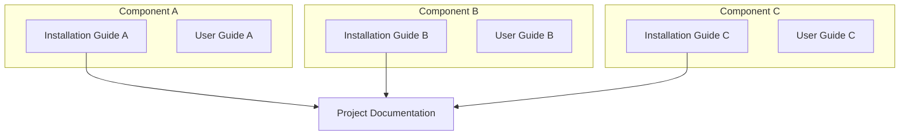

<h1 align="center">Installation Guide - Guideline</h1>
<hr>

> [!CAUTION]
> Make this document **private** by default. Only make it public after publishing the paper of this project.
>
> Request access with the GitHub admin in our group.

---
> [!NOTE]
> **Purpose of Installation, Integration, and User Guide**:
>
> - **Installation Guide**: Focuses on setup, configuration, and getting the system running.
> - **User Guide**: Focuses on how to **use** the system once it's installed and running.
> - **Project Documentation**: Define `System Architecture` & attach the installation guide link, `use case diagram`, `message-sequence chart (MSC)`, `class diagram`, `flowchart`.

Correlation between Installation, User Guides, and Project documentation:



## Table of Contents

> [!TIP]
> Generate the Table of Contents automatically using [Markdown All in One extension in VS Code](https://marketplace.visualstudio.com/items?itemName=yzhang.markdown-all-in-one#table-of-contents).

- [Table of Contents](#table-of-contents)
- [Project description](#project-description)
- [Execution Status](#execution-status)
- [System Architecture](#system-architecture)
- [Repository Structure](#repository-structure)
  - [Configuration](#configuration)
  - [Installation Steps](#installation-steps)
- [Post-Installation Verification](#post-installation-verification)
- [Troubleshooting](#troubleshooting)
  - [Common Issues and Solutions](#common-issues-and-solutions)
- [Additional Resources](#additional-resources)

## Project description

**Project Name:** [Replace with actual project name]

**Description:** A comprehensive solution for [specific use case]. This project provides [key functionality] and enables users to [main benefits].

**Key Features:**:

- Feature 1: [Brief description]
- Feature 2: [Brief description]
- Feature 3: [Brief description]

**Target Users:** [Developers/Researchers/System Administrators/etc.]## Access Method (if any)

> [!NOTE]
> Our servers are put in the server room. Please contact the admin for VPN access.

```shell
Host: <IP address>
User: <username>
```

```shell
ssh user@<IP address>

# The authenticity of host '192.168.1.100 (192.168.1.100)' can't be established.
# ECDSA key fingerprint is SHA256:xxxxxxxxxxxxxxxxxxxxxxxxxxxxxxxxxxxxxxxxxxx.
# Are you sure you want to continue connecting (yes/no/[fingerprint])? yes
# Warning: Permanently added '192.168.1.100' (ECDSA) to the list of known hosts.
# user@192.168.1.100's password: 
# Welcome to Ubuntu 22.04.3 LTS (GNU/Linux 5.15.0-87-generic x86_64)
# Last login: Mon Oct 21 10:30:15 2024 from 192.168.1.50
# user@hostname:~$
```

>[!NOTE]
> 

## Execution Status

> [!NOTE]
> **Status Icons:**
>
> - ✅ Completed successfully
> - ⏳ In progress / Pending
> - ❌ Error / Failed (with explanation)

| Step                                                                  | Status | Timeline    | Execution Status / Notes                                     |
| --------------------------------------------------------------------- | ------ | ----------- | ------------------------------------------------------------ |
| [Install Component A](#component-a-installation)                      | ✅     | 2024-10-15  | All services running                                         |
| [Install Component B](#component-b-installation)                      | ✅     | 2024-10-16  | Dependencies resolved successfully                           |
| [Configure Component A](#component-a-configuration)                   | ✅     | 2024-10-17  | Environment variables set                                    |
| [Configure Component B](#component-b-configuration)                   | ✅     | 2024-10-18  | Configuration files updated                                  |
| [Integrate Component A with Component B](#integration-testing)        | ✅     | 2024-10-19  | Communication verified                                       |
| [Run Post-Installation Tests](#post-installation-verification)        | ✅     | 2024-10-20  | All tests passed                                             |
| [Performance Optimization](#performance-tuning)                        | ⏳      | 2024-10-21  | In progress: tuning parameters                               |
| [Documentation and Reporting](#documentation)                          |        | 2024-10-22  |                                                              |

## System Architecture

> [!NOTE]
> **Draw.io Files Management:**
>
> If you create system architecture diagrams using draw.io:
>
> - Store the raw `.drawio` files in the `./docs/drawio` folder of your repository
> - Export diagrams as PNG/SVG and embed them in the documentation
> - Keep `draw.io` files versioned for easy updates and maintenance
> - Use consistent naming: `<project-name>.drawio`

**Important Components to Include in System Architecture:**

1. **IP Addresses** - Specify IP address for each module/component
2. **Connection Types** - Clear indication of connection types (WiFi, RJ-45, etc. ) & protocols (HTTP, TCP, UDP, WebSocket, etc.)
3. **Sub-module Structure** - Show internal components and their relationships
4. **Data Flow Direction** - Indicate request/response patterns
5. **Port Numbers** - Specify communication ports
6. **Network Boundaries** - Show different network segments (DMZ, internal, external)


## Repository Structure

```markdown
project-name/
├── src/                    # Source code
│   ├── main.py            # Main application entry point
│   └── modules/           # Application modules
├── config/                # Configuration files
│   ├── .env.example       # Environment variables template
│   └── settings.json      # Application settings
├── docs/                  # Documentation
├── tests/                 # Test files
├── requirements.txt       # Python dependencies
├── README.md             # Project overview
└── LICENSE               # License information
```

### Configuration

**Environment Variables:**
Create a `.env` file in the root directory with the following variables:

```bash
# Database Configuration
DB_HOST=localhost
DB_PORT=5432
DB_NAME=your_database_name
DB_USER=your_username
DB_PASSWORD=your_password

# Application Settings
APP_PORT=3000
APP_DEBUG=false
```

**Configuration Files:**
- `config/settings.json`: Contains application-specific settings
- Refer to `config/.env.example` for all available environment variables

### Installation Steps
Installation is the next section in an effective README. Tell other users how to install your project locally. Optionally, include a gif to make the process even more clear for other people.

1. **Clone the repository:**

    ```sh
    git clone https://github.com/your-username/your-repo.git
    cd your-repo
    
    # Cloning into 'your-repo'...
    # remote: Enumerating objects: 156, done.
    # remote: Counting objects: 100% (156/156), done.
    # remote: Compressing objects: 100% (98/98), done.
    # remote: Total 156 (delta 42), reused 156 (delta 42), pack-reused 0
    # Receiving objects: 100% (156/156), 45.23 KiB | 2.26 MiB/s, done.
    # Resolving deltas: 100% (42/42), done.
    ```

2. **Install dependencies:**

    ```sh
    pip install -r requirements.txt
    
    # Collecting package-name==1.2.3
    #   Downloading package-name-1.2.3-py3-none-any.whl (123 kB)
    #      ━━━━━━━━━━━━━━━━━━━━━━━━━━━━━━━━━━━━━━━━ 123.4/123.4 kB 3.2 MB/s eta 0:00:00
    # Installing collected packages: package-name, dependency-1, dependency-2
    # Successfully installed package-name-1.2.3 dependency-1-2.0.1 dependency-2-3.1.0
    ```

3. **Set up environment variables:**

    Create a `.env` file in the root directory and add the necessary environment variables. Refer to `.env.example` for guidance.

4. **Run the application:**

    ```sh
    python3 app.py
    
    # * Serving Flask app 'app'
    # * Debug mode: off
    # WARNING: This is a development server. Do not use it in a production deployment.
    # * Running on http://127.0.0.1:3000
    # Press CTRL+C to quit
    ```

##  Post-Installation Verification

Follow these steps to verify your installation was successful:

1. **Check Application Status:**

   ```bash
   # Check if the application is running
   ps aux | grep app.py
   
   # user     12345  0.5  2.1 345678 123456 ?      Ssl  10:30   0:15 python3 app.py
   # user     12346  0.0  0.0  12345   1234 pts/0  S+   10:45   0:00 grep --color=auto app.py
   ```

   **Expected Result:** You should see the process running with PID and resource usage information.

2. **Test Basic Functionality:**

   ```bash
   # Test API endpoint (if applicable)
   curl http://localhost:3000/health
   
   # HTTP/1.1 200 OK
   # Content-Type: application/json
   # Content-Length: 78
   # 
   # {"status": "OK", "timestamp": "2024-10-21T10:45:23.456Z", "uptime": 900}
   ```

   **Expected Result:** Response should return `{"status": "OK", "timestamp": "..."}` or similar.

3. **Verify Database Connection:**

   ```bash
   # Run database connectivity test
   python3 -c "from src.main import test_db_connection; test_db_connection()"
   
   # Connecting to database at localhost:5432...
   # Database connection successful!
   # Database: your_database_name
   # Server version: PostgreSQL 14.9
   # Connection latency: 12ms
   # Test query executed successfully
   ```

   **Expected Result:** Output should confirm successful database connection.

## Troubleshooting

### Common Issues and Solutions

1. **Issue: Port already in use**

   **Error Message:** `Address already in use: 3000`

   **Solution:**

   ```bash
   # Find process using the port
   sudo lsof -i :3000
   
   # COMMAND   PID  USER   FD   TYPE DEVICE SIZE/OFF NODE NAME
   # python3 12345  user    3u  IPv4 123456      0t0  TCP *:3000 (LISTEN)
   
   # Kill the process (replace PID with actual process ID)
   kill -9 12345
   
   # Process 12345 terminated
   ```

2. **Issue: Python dependencies not found**

   **Error Message:** `ModuleNotFoundError: No module named 'module_name'`

   **Solution:**

   ```bash
   # Reinstall dependencies
   pip install -r requirements.txt
   
   # Requirement already satisfied: package-name==1.2.3 in ./venv/lib/python3.10/site-packages
   # Collecting module_name
   #   Downloading module_name-2.1.0-py3-none-any.whl (456 kB)
   # Installing collected packages: module_name
   # Successfully installed module_name-2.1.0
   
   # Or install specific package
   pip install module_name
   
   # Collecting module_name
   #   Downloading module_name-2.1.0-py3-none-any.whl (456 kB)
   # Installing collected packages: module_name
   # Successfully installed module_name-2.1.0
   ```

3. **Issue: Permission denied errors**

   **Error Message:** `Permission denied: '/path/to/file'`

   **Solution:**

   ```bash
   # Fix file permissions
   chmod 755 /path/to/file
   
   # (No output on success)
   
   # Or run with appropriate user permissions
   sudo python3 app.py
   
   # [sudo] password for user: 
   # * Serving Flask app 'app'
   # * Debug mode: off
   # * Running on http://127.0.0.1:3000
   # Press CTRL+C to quit
   ```

## Additional Resources

**Documentation:**:

- [Official Project Documentation](https://your-project-docs.com)
- [API Reference Guide](https://your-project-api.com)
- [Configuration Reference](https://your-project-config.com)

**Community Support:**
- [GitHub Issues](https://github.com/your-username/your-repo/issues)
- [Stack Overflow Tag](https://stackoverflow.com/questions/tagged/your-project)
- [Discord Community](https://discord.gg/your-project)

**Contact:**
- **Maintainer:** Your Name (your.email@example.com)
- **Support Team:** support@your-project.com
- **Emergency Contact:** +1-xxx-xxx-xxxx (for critical issues only)

---

> [!NOTE]
> This installation guide is regularly updated. For the latest version, check the [GitHub repository](https://github.com/your-username/your-repo).
