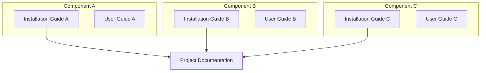

<h1 align="center">Integration Guide - Guideline</h1>
<hr>

> [!CAUTION]
> Make this document **private** by default. Only make it public after publishing the paper of this project.
>
> Request access with the GitHub admin in our group.

---
> [!NOTE]
> **Purpose of Integration Guide vs User Guide**:
>
> - **Integration Guide**: Covers per-component **installation** (setup, configuration, dependencies) and **end-to-end integration** (connecting components, verifying interfaces). This is the single document for getting the full system running.
> - **User Guide**: Focuses on how to **use** the system once it is installed and running.
> - **Project Documentation**: Defines `System Architecture` & attaches the integration guide link, `use case diagram`, `message-sequence chart (MSC)`, `class diagram`, `flowchart`.

Correlation between Integration Guide, User Guide, and Project Documentation:



## Table of Contents

> [!TIP]
> Generate the Table of Contents automatically using [Markdown All in One extension in VS Code](https://marketplace.visualstudio.com/items?itemName=yzhang.markdown-all-in-one#table-of-contents).

- [Table of Contents](#table-of-contents)
- [Guideline](#guideline)
- [Project description](#project-description)
- [Execution Status](#execution-status)
- [System Architecture](#system-architecture)
- [Repository Structure](#repository-structure)
  - [Configuration](#configuration)
  - [Installation Steps](#installation-steps)
- [End-to-End Walkthrough](#end-to-end-walkthrough)
- [Post-Installation Verification](#post-installation-verification)
- [Known Issues](#known-issues)
- [Troubleshooting](#troubleshooting)
  - [Common Issues and Solutions](#common-issues-and-solutions)
- [Additional Resources](#additional-resources)

## Guideline

When documenting installation or integration steps:

1. write the command the user must run as a code block with the appropriate shell language tag.
2. Comment out the terminal output directly within the **same** code block using `#` symbols in the beginning of each output line.

Example:

```shell
echo "Hello, World!"

# Hello, World!
```

> [!CAUTION]
> If the output of the terminal is too long, only attach the snippet of the relevant output that indicates success or failure.
>
> For the complete log, you can store in a folder `./logs`, and provide a link to the log file in the document.

### Generating from the captured terminal log

Terminal activity is captured automatically by the lab terminal-logging system (`termlog` schema, managed by `bmw-ece-ntust/llm-skill-logging`; see [daily-log.md](./daily-log.md) and [lab-automation/llm-memory.md](./lab-automation/llm-memory.md)). Generate the guide **from that stored data** rather than from memory — run the `/integration-guide` skill, which pulls the session's commands (ordered on the shared UTC timestamp) and renders each in a `shell` block with its output as `#`-commented lines per the rules above.

Two rules keep the guide readable:

1. **Only the required steps.** Document the shortest successful path to the target — the commands that actually worked and are on the critical path. Drop exploratory, repeated, and dead-end commands from the main flow; a successor should be able to run the steps top-to-bottom and reach a working state.
2. **Debugging goes to the bottom.** The failed attempts, wrong turns, and their fixes are valuable but must not clutter the main steps. Collect them in a **Debugging** section at the bottom of the document (use the existing [Known Issues](#known-issues) / [Troubleshooting](#troubleshooting) sections), each as *symptom → cause → fix*.

## Project description

**Project Name:** [Replace with actual project name]

**Description:** A comprehensive solution for [specific use case]. This project provides [key functionality] and enables users to [main benefits].

**Key Features:**:

- Feature 1: [Brief description]
- Feature 2: [Brief description]
- Feature 3: [Brief description]

**Target Users:** [Developers/Researchers/System Administrators/etc.]## Access Method (if any)

> [!NOTE]
> Our servers are put in the server room. Please contact the admin for VPN access.

```shell
Host: <IP address>
User: <username>
```

```shell
ssh user@<IP address>

# The authenticity of host '192.168.1.100 (192.168.1.100)' can't be established.
# ECDSA key fingerprint is SHA256:xxxxxxxxxxxxxxxxxxxxxxxxxxxxxxxxxxxxxxxxxxx.
# Are you sure you want to continue connecting (yes/no/[fingerprint])? yes
# Warning: Permanently added '192.168.1.100' (ECDSA) to the list of known hosts.
# user@192.168.1.100's password: 
# Welcome to Ubuntu 22.04.3 LTS (GNU/Linux 5.15.0-87-generic x86_64)
# Last login: Mon Oct 21 10:30:15 2024 from 192.168.1.50
# user@hostname:~$
```

>[!NOTE]
> 

## Execution Status

> [!NOTE]
> **Status Icons:**
>
> - ✅ Completed successfully
> - ⏳ In progress / Pending
> - ❌ Error / Failed (with explanation)

| Step                                                                  | Status | Timeline    | Execution Status / Notes                                     |
| --------------------------------------------------------------------- | ------ | ----------- | ------------------------------------------------------------ |
| [Install Component A](#component-a-installation)                      | ✅     | 2024-10-15  | All services running                                         |
| [Install Component B](#component-b-installation)                      | ✅     | 2024-10-16  | Dependencies resolved successfully                           |
| [Configure Component A](#component-a-configuration)                   | ✅     | 2024-10-17  | Environment variables set                                    |
| [Configure Component B](#component-b-configuration)                   | ✅     | 2024-10-18  | Configuration files updated                                  |
| [Integrate Component A with Component B](#integration-testing)        | ✅     | 2024-10-19  | Communication verified                                       |
| [Run Post-Installation Tests](#post-installation-verification)        | ✅     | 2024-10-20  | All tests passed                                             |
| [Performance Optimization](#performance-tuning)                        | ⏳      | 2024-10-21  | In progress: tuning parameters                               |
| [Documentation and Reporting](#documentation)                          |        | 2024-10-22  |                                                              |

## System Architecture

> [!NOTE]
> **Draw.io Files Management:**
>
> If you create system architecture diagrams using draw.io:
>
> - Store the raw `.drawio` files in the `./docs/drawio` folder of your repository
> - Export diagrams as PNG/SVG and embed them in the documentation
> - Keep `draw.io` files versioned for easy updates and maintenance
> - Use consistent naming: `<project-name>.drawio`

**Important Components to Include in System Architecture:**

1. **IP Addresses** - Specify IP address for each module/component
2. **Connection Types** - Clear indication of connection types (WiFi, RJ-45, etc. ) & protocols (HTTP, TCP, UDP, WebSocket, etc.)
3. **Sub-module Structure** - Show internal components and their relationships
4. **Data Flow Direction** - Indicate request/response patterns
5. **Port Numbers** - Specify communication ports.
6. **Network Boundaries** - Show different network segments (DMZ, internal, external)


## Repository Structure

```markdown
project-name/
├── src/                    # Source code
│   ├── main.py            # Main application entry point
│   └── modules/           # Application modules
├── config/                # Configuration files
│   ├── .env.example       # Environment variables template
│   └── settings.json      # Application settings
├── docs/                  # Documentation
├── tests/                 # Test files
├── requirements.txt       # Python dependencies
├── README.md             # Project overview
└── LICENSE               # License information
```

### Configuration

**Environment Variables:**
Create a `.env` file in the root directory with the following variables:

```bash
# Database Configuration
DB_HOST=localhost
DB_PORT=5432
DB_NAME=your_database_name
DB_USER=your_username
DB_PASSWORD=your_password

# Application Settings
APP_PORT=3000
APP_DEBUG=false
```

**Configuration Files:**
- `config/settings.json`: Contains application-specific settings
- Refer to `config/.env.example` for all available environment variables

### Installation Steps
Installation is the next section in an effective README. Tell other users how to install your project locally. Optionally, include a gif to make the process even more clear for other people.

1. **Clone the repository:**

    ```sh
    git clone https://github.com/your-username/your-repo.git
    cd your-repo
    
    # Cloning into 'your-repo'...
    # remote: Enumerating objects: 156, done.
    # remote: Counting objects: 100% (156/156), done.
    # remote: Compressing objects: 100% (98/98), done.
    # remote: Total 156 (delta 42), reused 156 (delta 42), pack-reused 0
    # Receiving objects: 100% (156/156), 45.23 KiB | 2.26 MiB/s, done.
    # Resolving deltas: 100% (42/42), done.
    ```

2. **Install dependencies:**

    ```sh
    pip install -r requirements.txt
    
    # Collecting package-name==1.2.3
    #   Downloading package-name-1.2.3-py3-none-any.whl (123 kB)
    #      ━━━━━━━━━━━━━━━━━━━━━━━━━━━━━━━━━━━━━━━━ 123.4/123.4 kB 3.2 MB/s eta 0:00:00
    # Installing collected packages: package-name, dependency-1, dependency-2
    # Successfully installed package-name-1.2.3 dependency-1-2.0.1 dependency-2-3.1.0
    ```

3. **Set up environment variables:**

    Create a `.env` file in the root directory and add the necessary environment variables. Refer to `.env.example` for guidance.

4. **Run the application:**

    ```sh
    python3 app.py
    
    # * Serving Flask app 'app'
    # * Debug mode: off
    # WARNING: This is a development server. Do not use it in a production deployment.
    # * Running on http://127.0.0.1:3000
    # Press CTRL+C to quit
    ```

## End-to-End Walkthrough

> [!IMPORTANT]
> Every integration guide must include a single end-to-end walkthrough section that chains all components in the correct startup order. A successor must be able to follow this section alone to bring the full system from a clean state to a working state.

**Required structure:**

1. **Component startup order** — list which service must be running before the next one starts
2. **Each step**: command(s) to run + expected output confirming the component is ready
3. **Inter-component verification** — confirm each interface is working before proceeding (e.g., verify SCTP link is up before testing E2)
4. **Estimated time** — note how long each step typically takes (helps successors plan)
5. **Single E2E test** — one command or API call that exercises the full chain end-to-end

**Example template:**

```markdown
## End-to-End Walkthrough

Starting from a clean deployment, bring up the full system in this order.
Total estimated time: ~45 minutes.

### 1. Start Component A (5 min)
```bash
cd src/component-a && python3 app.py --config config/.env
# [INFO] Component A listening on port 8080
```

### 2. Start Component B — depends on A (10 min)
```bash
curl http://localhost:8080/health  # verify A is up first
cd src/component-b && ./start.sh
# [INFO] Connected to Component A at localhost:8080
# [INFO] Component B ready
```

### 3. Run E2E test — verifies the full chain
```bash
curl -X POST http://localhost:8090/api/run-test \
  -H "Content-Type: application/json" \
  -d '{"scenario": "basic"}'
# {"status": "PASSED", "duration_ms": 1234}
```
```

---

##  Post-Installation Verification

Follow these steps to verify your installation was successful:

1. **Check Application Status:**

   ```bash
   # Check if the application is running
   ps aux | grep app.py
   
   # user     12345  0.5  2.1 345678 123456 ?      Ssl  10:30   0:15 python3 app.py
   # user     12346  0.0  0.0  12345   1234 pts/0  S+   10:45   0:00 grep --color=auto app.py
   ```

2. **Test Basic Functionality:**

   ```bash
   # Test API endpoint (if applicable)
   curl http://localhost:3000/health
   
   # HTTP/1.1 200 OK
   # Content-Type: application/json
   # Content-Length: 78
   # 
   # {"status": "OK", "timestamp": "2024-10-21T10:45:23.456Z", "uptime": 900}
   ```

3. **Verify Database Connection:**

   ```bash
   # Run database connectivity test
   python3 -c "from src.main import test_db_connection; test_db_connection()"
   
   # Connecting to database at localhost:5432...
   # Database connection successful!
   # Database: your_database_name
   # Server version: PostgreSQL 14.9
   # Connection latency: 12ms
   # Test query executed successfully
   ```

4. **Verify O1 Interface (NETCONF/YANG + VES):**

   The O1 interface connects the SMO/Non-RT RIC to O-RAN Network Functions (O-DU, O-CU) using:
   - **NETCONF** (port 830) for CM (Configuration Management)
   - **VES** (`POST /eventListener/v7`) for FM (Fault Management) and PM (Performance Management) event streaming

   > [!NOTE]
   > Reference: [O-RAN SC OAM Project](https://docs.o-ran-sc.org/projects/o-ran-sc-oam/en/latest/) and O-RAN.WG10.O1-Interface specification.

   1. **Verify NETCONF (CM) — O-RAN NF side:**

      ```bash
      # Check NETCONF server is listening on port 830 on the O-RAN NF
      netstat -tnlp | grep 830

      # tcp  0  0  0.0.0.0:830  0.0.0.0:*  LISTEN  12345/netconfd
      ```

      ```bash
      # Open a NETCONF session and retrieve YANG capabilities from the NF
      ssh -p 830 -s netconf admin@<O-RAN-NF-IP>

      # <?xml version="1.0" encoding="UTF-8"?>
      # <hello xmlns="urn:ietf:params:xml:ns:netconf:base:1.0">
      #   <capabilities>
      #     <capability>urn:ietf:params:netconf:base:1.1</capability>
      #     <capability>urn:o-ran:o1:1.0</capability>
      #     <capability>urn:o-ran:supervision:1.0</capability>
      #     ...
      #   </capabilities>
      # </hello>
      ```

   2. **Verify VES Collector (FM/PM) — SMO side:**

      The VES Collector receives HTTP POST events on `/eventListener/v7`. Do **not** use `GET /events` — that endpoint does not exist. Verify by inspecting container logs.

      ```bash
      # Tail VES collector container logs to confirm incoming events
      kubectl logs -n onap deployment/dcae-ves-collector --tail=50 | grep -E "pnfRegistration|heartbeat|stndDefined|Fault"
      # (or for Docker: docker logs ves-collector --tail=50)

      # [INFO] VES event received: domain=pnfRegistration, sourceName=o-ran-nf-1
      # [INFO] VES event received: domain=heartbeat, sourceName=o-ran-nf-1, sequence=1
      # [INFO] VES event received: domain=stndDefined, stndDefinedNamespace=3GPP-PerformanceAssurance
      ```

      ```bash
      # Optionally: send a test VES event manually to confirm the collector is reachable
      curl -X POST http://<VES-collector-IP>:8080/eventListener/v7 \
        -H "Content-Type: application/json" \
        -u <user>:<password> \
        -d '{"event":{"commonEventHeader":{"domain":"heartbeat","eventName":"heartbeat_O_RAN_COMPONENT","sourceName":"test-nf","version":"4.0","vesEventListenerVersion":"7.2"}}}'

      # HTTP/1.1 202 Accepted
      ```

5. **Verify E2 Interface (E2AP over SCTP):**

   The E2 interface connects the Near-RT RIC to E2 Nodes (O-CU-CP, O-CU-UP, O-DU) using E2AP over SCTP.

   ```bash
   # Confirm SCTP association is established between Near-RT RIC and E2 Node
   ss -tn | grep 36421

   # ESTAB  0  0  <Near-RT-RIC-IP>:36421  <E2-Node-IP>:XXXXX
   ```

   ```bash
   # Check Near-RT RIC logs for a successful E2 Setup procedure
   grep -i "E2 Setup Response\|E2SetupResponse" /var/log/near-rt-ric/*.log

   # [INFO]  Received E2SetupResponse from E2-Node: o-du-1 (PLMN: 00101, NB-ID: 1)
   # [INFO]  E2 interface to o-du-1 is UP
   ```

   ```bash
   # Verify an xApp subscription is active and RIC Indications are flowing
   grep -i "RICIndication\|Indication received" /var/log/xapp/*.log | tail -5

   # [INFO]  RICIndication received from E2-Node: o-du-1, RAN Function: 2, Sequence: 1041
   # [INFO]  RICIndication received from E2-Node: o-du-1, RAN Function: 2, Sequence: 1042
   ```

6. **Verify R1 Interface (rApp ↔ Non-RT RIC via DME & SME):**

   The R1 interface is the service-based interface between rApps and the Non-RT RIC platform (O-RAN.WG2.R1AP specification). It is composed of two functional blocks:

   - **DME (Data Management and Exposure)** — realized by the **Information Coordination Service (ICS)**. Decouples data producers from data consumers via Information Types and Information Jobs.
   - **SME (Service Management and Exposure)** — realized by the **CAPIF-based Service Manager** (3GPP CAPIF APIs). Enables rApps and SMO components to register, publish, discover, and invoke each other's service APIs through a Kong API gateway.

   > [!NOTE]
   > References:
   > - [O-RAN SC ICS (DME)](https://docs.o-ran-sc.org/projects/o-ran-sc-nonrtric-plt-informationcoordinatorservice/en/latest/)
   > - [O-RAN SC SME (CAPIF)](https://docs.o-ran-sc.org/projects/o-ran-sc-nonrtric-plt-sme/en/latest/)

   1. **Verify DME (Information Coordination Service / ICS):**

      ```bash
      # Check ICS (DME) is running and healthy
      curl -s http://<ICS-IP>:<port>/status

      # {"status":"success"}
      ```

      ```bash
      # List all registered Information Types (data types exposed over R1)
      curl -s http://<ICS-IP>:<port>/data-producer/v1/info-types | python3 -m json.tool

      # [
      #   "pm-data-type-1",
      #   "fault-event-type-1"
      # ]
      ```

      ```bash
      # List all registered data producers
      curl -s http://<ICS-IP>:<port>/data-producer/v1/info-producers | python3 -m json.tool

      # [
      #   "producer-rapp-1",
      #   "producer-rapp-2"
      # ]
      ```

      ```bash
      # List active Information Jobs (data consumer subscriptions)
      curl -s http://<ICS-IP>:<port>/data-consumer/v1/info-jobs | python3 -m json.tool

      # [
      #   {
      #     "info_job_id": "job-001",
      #     "info_type_id": "pm-data-type-1",
      #     "job_owner": "consumer-rapp-1",
      #     "status": "ENABLED"
      #   }
      # ]
      ```

   2. **Verify SME (Service Management and Exposure / CAPIF):**

      SME uses the CAPIF core function to let API providers (rApps, SMO components) publish services, and API invokers (rApps, consumers) discover and call them via the Kong gateway.

      ```bash
      # Check the SME / CAPIF core function is running
      curl -s http://<SME-IP>:<port>/api-provider-management/v1/health

      # {"status":"OK"}
      ```

      ```bash
      # List all published service APIs (APIs registered by providers/rApps)
      curl -s http://<SME-IP>:<port>/published-apis/v1/<apfId>/service-apis | python3 -m json.tool

      # [
      #   {
      #     "apiId": "api-001",
      #     "apiName": "pm-kpi-rapp-api",
      #     "description": "Exposes PM KPIs from rApp over R1",
      #     "aefProfiles": [{"aefId": "aef-001", "versions": [{"apiVersion": "v1"}]}]
      #   }
      # ]
      ```

      ```bash
      # Discover available service APIs as an invoker (rApp or SMO component)
      curl -s "http://<SME-IP>:<port>/service-apis/v1/allServiceAPIs?api-invoker-id=<invoker-id>" \
        | python3 -m json.tool

      # {
      #   "serviceAPIDescriptions": [
      #     {
      #       "apiName": "pm-kpi-rapp-api",
      #       "apiId": "api-001",
      #       "aefProfiles": [{"versions": [{"apiVersion": "v1"}], "protocol": "HTTP_1_1"}]
      #     }
      #   ]
      # }
      ```

      ```bash
      # Verify Kong gateway is routing requests to a registered API
      curl -s http://<Kong-gateway-IP>:<port>/<api-route>/v1/health

      # {"status":"OK"}
      ```

7. **Verify InfluxDB — PM Data Stored via O1:**

   PM events received over O1 (VES `stndDefined` / file-based PM) are parsed and stored in InfluxDB by the SMO's PM data pipeline.

   ```bash
   # Check InfluxDB is running and reachable
   curl -s http://<InfluxDB-IP>:8086/health

   # {"checks":[],"commit":"...","date":"...","name":"influxdb","status":"pass","version":"2.x.x"}
   ```

   ```bash
   # Query the latest PM measurements written from O-RAN NF (adjust bucket/measurement names)
   influx query '
     from(bucket: "oranpm")
       |> range(start: -1h)
       |> filter(fn: (r) => r._measurement == "NRCellDU")
       |> last()
   ' --host http://<InfluxDB-IP>:8086 --token <your-token> --org <your-org>

   # Result: _measurement  _field         _value  sourceName    _time
   #         NRCellDU      RRU.PrbUsedDl  72.5    o-du-1        2024-10-21T10:45:00Z
   #         NRCellDU      RRU.PrbUsedUl  58.1    o-du-1        2024-10-21T10:45:00Z
   ```

   ```bash
   # (Alternative) Query via InfluxDB HTTP API with Flux
   curl -s -X POST http://<InfluxDB-IP>:8086/api/v2/query \
     -H "Authorization: Token <your-token>" \
     -H "Content-Type: application/vnd.flux" \
     -d 'from(bucket:"oranpm") |> range(start:-1h) |> filter(fn:(r) => r._measurement == "NRCellDU") |> last()'

   # ,result,table,_start,...,_measurement,_field,_value,sourceName
   # ,_result,0,...,NRCellDU,RRU.PrbUsedDl,72.5,o-du-1
   ```

8. **Verify Grafana — PM Data Displayed from InfluxDB via R1:**

   Grafana uses InfluxDB as a datasource. In an O-RAN setup, the data consumed by Grafana dashboards comes from InfluxDB, which is populated via O1 PM. An rApp may expose aggregated KPIs over the R1 interface, which are also stored in InfluxDB for visualization.

   ```bash
   # Check Grafana is running and healthy
   curl -s http://<Grafana-IP>:3000/api/health

   # {"commit":"...","database":"ok","timestamp":"...","version":"10.x.x"}
   ```

   ```bash
   # Verify the InfluxDB datasource is configured and reachable in Grafana
   curl -s -u admin:<grafana-password> http://<Grafana-IP>:3000/api/datasources | \
     python3 -m json.tool | grep -E '"name"|"type"|"url"'

   # "name": "InfluxDB-ORANPM",
   # "type": "influxdb",
   # "url": "http://<InfluxDB-IP>:8086",
   ```

   ```bash
   # Test the datasource connectivity from Grafana to InfluxDB
   curl -s -u admin:<grafana-password> \
     -X POST http://<Grafana-IP>:3000/api/datasources/proxy/<datasource-id>/api/v2/query \
     -H "Content-Type: application/vnd.flux" \
     -d 'from(bucket:"oranpm") |> range(start:-5m) |> count()'

   # ,result,table,...,_value
   # ,_result,0,...,42
   ```

   > [!TIP]
   > To visually confirm: open the Grafana dashboard in a browser at `http://<Grafana-IP>:3000`, navigate to the O-RAN PM dashboard, and verify that graphs for KPIs such as PRB utilization, throughput, and cell availability show live or recent data points.

## Known Issues

> [!IMPORTANT]
> This section is **required** in every integration guide. Document every known failure mode, expired credential, hardware quirk, or unresolved integration issue. A successor who hits an undocumented failure will waste days debugging what took you hours to figure out the first time.

Use the following table format:

| Issue | Severity | Status | Workaround / Steps to Resolve |
|-------|----------|--------|-------------------------------|
| [Short description of the failure] | ❌ BLOCK / ⚠️ WARN / ℹ️ INFO | Open / Resolved / Workaround | Step-by-step to unblock |

**Severity guide:**
- `❌ BLOCK` — prevents the system from running; must be fixed or documented as "build from source" before handover
- `⚠️ WARN` — system runs but a component is degraded; must have a documented workaround
- `ℹ️ INFO` — cosmetic or edge-case issue; note for awareness

**What to document here:**
- Container image pull failures (expired tokens, private registry access)
- Git submodule empty after plain clone (add `git submodule update --init` step)
- API endpoints or config parameters that changed from the thesis diagrams
- Hardware-specific timing or driver quirks
- Integration failures that are known to be flaky (with retry instructions)
- Experimental configurations that always fail (mark as out of scope)
- Data anomalies in datasets (sensor glitches, FAILED configs)

**Example:**

| Issue | Severity | Status | Workaround |
|-------|----------|--------|------------|
| NFO image `registry.example.com/nfo:latest` returns 401 | ❌ BLOCK | Token expired | Run `docker login registry.example.com` with credentials from the lab secrets vault; token rotates every 90 days |
| `src/sideloader/` empty after plain `git clone` | ❌ BLOCK | Submodule | Run `git submodule update --init --recursive` or re-clone with `--recursive` |
| TEIV adapter logs "JSON is empty" | ⚠️ WARN | Open | Restart FOCOM pod first (`kubectl rollout restart deploy/focom`), then restart TEIV |
| Pegatron/OKD/8-core/700Mbps always FAILED | ℹ️ INFO | Hardware limit | Known incompatibility; exclude this config from benchmarks |

## Troubleshooting

### Common Issues and Solutions

1. **Issue: Port already in use**

   ```error
   Address already in use: 3000
   ```

   **Solution:**

   ```bash
   # Find process using the port
   sudo lsof -i :3000
   
   # COMMAND   PID  USER   FD   TYPE DEVICE SIZE/OFF NODE NAME
   # python3 12345  user    3u  IPv4 123456      0t0  TCP *:3000 (LISTEN)
   
   # Kill the process (replace PID with actual process ID)
   kill -9 12345
   
   # Process 12345 terminated
   ```

2. **Issue: Python dependencies not found**

   **Error Message:** `ModuleNotFoundError: No module named 'module_name'`

   **Solution:**

   ```bash
   # Reinstall dependencies
   pip install -r requirements.txt
   
   # Requirement already satisfied: package-name==1.2.3 in ./venv/lib/python3.10/site-packages
   # Collecting module_name
   #   Downloading module_name-2.1.0-py3-none-any.whl (456 kB)
   # Installing collected packages: module_name
   # Successfully installed module_name-2.1.0
   
   # Or install specific package
   pip install module_name
   
   # Collecting module_name
   #   Downloading module_name-2.1.0-py3-none-any.whl (456 kB)
   # Installing collected packages: module_name
   # Successfully installed module_name-2.1.0
   ```

3. **Issue: Permission denied errors**

   **Error Message:** `Permission denied: '/path/to/file'`

   **Solution:**

   ```bash
   # Fix file permissions
   chmod 755 /path/to/file
   
   # (No output on success)
   
   # Or run with appropriate user permissions
   sudo python3 app.py
   
   # [sudo] password for user: 
   # * Serving Flask app 'app'
   # * Debug mode: off
   # * Running on http://127.0.0.1:3000
   # Press CTRL+C to quit
   ```

## Additional Resources

**Documentation:**:

- [Official Project Documentation](https://your-project-docs.com)
- [API Reference Guide](https://your-project-api.com)
- [Configuration Reference](https://your-project-config.com)

**Community Support:**
- [GitHub Issues](https://github.com/your-username/your-repo/issues)
- [Stack Overflow Tag](https://stackoverflow.com/questions/tagged/your-project)
- [Discord Community](https://discord.gg/your-project)

**Contact:**
- **Maintainer:** Your Name (your.email@example.com)
- **Support Team:** support@your-project.com
- **Emergency Contact:** +1-xxx-xxx-xxxx (for critical issues only)

---

> [!NOTE]
> This installation guide is regularly updated. For the latest version, check the [GitHub repository](https://github.com/your-username/your-repo).
