<h1 align="center">Programming — Source Code Standards & Study Guide</h1>

---

> [!WARNING]
> Follow this guideline for **all** thesis project source code in the BMW Lab.
> Code that does not meet these standards will not pass the handover review.

> [!NOTE]
> **How to read this document.** It is both a **standard** (what your code must satisfy) and a **study guide** (why each rule exists, with examples you can copy). Read Sections 1–6 to learn the programming skills the lab expects; use Sections 7–13 as the reference you return to while building an rApp / xApp. If you are new, work through it top to bottom once, then keep it open while you code.

> [!NOTE]
> **Relationship to `research.md`:** the class diagram, flowcharts, and system parameters in [research.md](./research.md) are the **design contract**. Source code must implement exactly what those diagrams describe — names, interfaces, and responsibilities must match.

---

## Table of Contents

<!-- TOC -->

- [1. Design-First Approach](#1-design-first-approach)
- [2. Object-Oriented Programming (OOP)](#2-object-oriented-programming-oop)
  - [2.1 Encapsulation — Hide State Behind Methods](#21-encapsulation--hide-state-behind-methods)
  - [2.2 Abstraction — Depend on Interfaces, Not Implementations](#22-abstraction--depend-on-interfaces-not-implementations)
  - [2.3 Inheritance — Share Behavior Through a Base Class](#23-inheritance--share-behavior-through-a-base-class)
  - [2.4 Polymorphism — One Call Site, Many Behaviors](#24-polymorphism--one-call-site-many-behaviors)
- [3. Design Patterns](#3-design-patterns)
  - [3.1 Adapter Pattern](#31-adapter-pattern)
  - [3.2 Abstract Factory Pattern](#32-abstract-factory-pattern)
  - [3.3 Strategy Pattern](#33-strategy-pattern)
  - [3.4 Which Pattern Solves Which Problem](#34-which-pattern-solves-which-problem)
- [4. Code Documentation (Sphinx / Doxygen)](#4-code-documentation-sphinx--doxygen)
- [5. Folder Structure](#5-folder-structure)
  - [5.1 One Class per File](#51-one-class-per-file)
- [6. General Architecture](#6-general-architecture)
- [7. O-RAN Protocol Rules](#7-o-ran-protocol-rules)
- [8. 3GPP Parameter Enumeration](#8-3gpp-parameter-enumeration)
- [9. Multi-vendor Support](#9-multi-vendor-support)
- [10. Intent-Based Networking (IBN)](#10-intent-based-networking-ibn)
- [11. Production Readiness](#11-production-readiness)
  - [11.1 Container Images](#111-container-images)
  - [11.2 Git Submodules](#112-git-submodules)
  - [11.3 Known Issues](#113-known-issues)
  - [11.4 API Endpoint Consistency](#114-api-endpoint-consistency)
  - [11.5 Secrets and Environment Variables](#115-secrets-and-environment-variables)
- [12. Standards and Parameter Reference Convention](#12-standards-and-parameter-reference-convention)
  - [12.1 Rule](#121-rule)
  - [12.2 Spec Archive URLs](#122-spec-archive-urls)
  - [12.3 System Parameters Table — Required Columns](#123-system-parameters-table--required-columns)
- [13. Code Quality & Git Hygiene](#13-code-quality--git-hygiene)

<!-- /TOC -->

---

## 1. Design-First Approach

**Why this comes first.** Code is the most expensive place to discover a design mistake — a wrong class boundary found on a diagram costs a five-minute redraw; the same mistake found after 2,000 lines costs a week. Designing first also produces the artifacts the *next* student needs to understand your work, and it keeps `research.md` and the code in sync because both derive from the same diagrams.

Before writing any code, produce the following artifacts **in order** in `research.md`:

| Order | Artifact | Purpose |
| --- | --- | --- |
| 1 | **Flowchart** | Define program logic: initialization → processing → output |
| 2 | **Class Diagram** | Define classes, attributes, methods, relationships |
| 3 | **State Machine Diagram** | Define runtime states + transition triggers (app lifecycle, controlled resources) — see [research.md](./research.md#state-machine-diagram) |
| 4 | **System Parameters Table** | Define all inputs/outputs with 3GPP/IEEE spec references |

> [!CAUTION]
> Do not start implementation until the flowchart, class diagram, and state
> machine diagram are reviewed and approved in a weekly meeting. The diagram is
> a contract: once approved, the code must match it, and any change to one is a
> change to both.

---

## 2. Object-Oriented Programming (OOP)

**Why OOP for this lab.** An rApp is a long-lived system that many students will extend over years. OOP gives you the four tools that keep such a system changeable: you can hide what varies, depend on stable interfaces, reuse shared behavior, and add new cases without editing old ones. Every design pattern in Section 3 is built from these four ideas, so learn them first.

Reference: [Python OOP Guide (RealPython)](https://realpython.com/python3-object-oriented-programming/)

### 2.1 Encapsulation — Hide State Behind Methods

**What it is.** Bundle data and the methods that act on it in one class, expose a small controlled interface, and keep internals private (`_name`).

**Why it matters.** If any code can mutate an object's fields directly, a bad value can enter from anywhere and you can never trace or prevent it — and you can never change the internal representation without breaking every caller. Encapsulation gives you **one place** to enforce an invariant and the freedom to refactor internals later.

```python
# Fragile — the caller reaches into internals; nothing validates the value
report.prb_util_dl = 1.7          # an impossible ratio, silently accepted

# Encapsulated — the class guards its own invariant in one place
class KpiReport:
    def __init__(self) -> None:
        self._prb_util_dl = 0.0

    @property
    def prb_util_dl(self) -> float:
        return self._prb_util_dl

    @prb_util_dl.setter
    def prb_util_dl(self, value: float) -> None:
        if not 0.0 <= value <= 1.0:
            raise ValueError("PRB utilization must be a 0–1 ratio")
        self._prb_util_dl = value
```

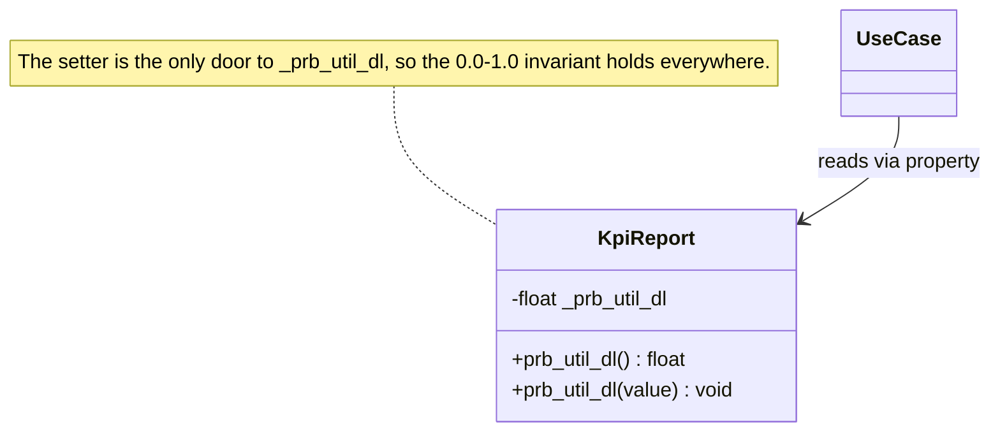

**In the lab.** `KpiReport`, `PolicyDecision`, and `NetworkTopology` own their data; use-cases read them through methods, never by poking attributes.

### 2.2 Abstraction — Depend on Interfaces, Not Implementations

**What it is.** Define *what* a component does (an abstract base class or a `Protocol`) separately from *how* any particular class does it.

**Why it matters.** Your algorithm should not care whether KPIs come from a real gNB, a simulator, or a mock. If the core depends on a concrete class, you cannot test it without the real system, and swapping backends means editing the core. Depending on an abstraction lets you swap implementations freely and test the core in isolation.

```python
from abc import ABC, abstractmethod

class TelemetryCollector(ABC):
    @abstractmethod
    def collect(self, cell_id: str) -> KpiReport: ...

# Core logic depends on TelemetryCollector — not on E2TelemetryCollector
# or MockTelemetryCollector. Either can be supplied without touching the core.
```

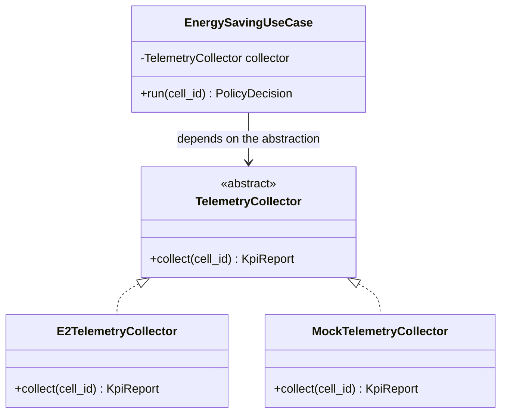

The use-case has no arrow to either concrete collector — that absence is the whole point. It is why the same use-case runs unchanged against a real gNB and against a mock in your unit tests.

**In the lab.** Every adapter implements an abstract Port; the Abstract Factory ([Section 3.2](#32-abstract-factory-pattern)) selects the concrete one at runtime.

### 2.3 Inheritance — Share Behavior Through a Base Class

**What it is.** A subclass reuses and specializes the behavior of a base class.

**Why it matters.** Common plumbing (E2/ICS subscription, logging, lifecycle) lives once in the base; each rApp variant adds only what is unique. Without it, you copy the shared plumbing into every rApp and every fix must be repeated N times.

```python
class BaseRApp:
    def start(self) -> None:          # subscribe to E2/ICS, register intents, ...
        ...

class EnergySavingRApp(BaseRApp):
    def on_kpi(self, kpis: KpiReport) -> PolicyDecision:   # only the unique logic
        ...
```

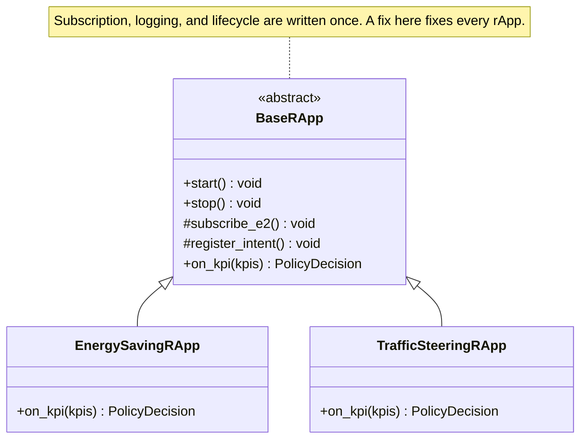

> [!CAUTION]
> **Prefer composition when the relationship is "has-a," not "is-a."** Deep inheritance trees are hard to follow; one level of meaningful specialization is usually enough. If you find yourself overriding most of the base class, you wanted composition (or the Strategy pattern) instead.

### 2.4 Polymorphism — One Call Site, Many Behaviors

**What it is.** Classes that share an interface are interchangeable; the caller invokes the same method and each object responds in its own way.

**Why it matters.** It removes `if vendor == "ericsson": … elif vendor == "nokia": …` branching. Adding a vendor or an algorithm becomes "add a class," not "edit every branch" — which is exactly what makes the Strategy and Factory patterns possible.

```python
# Branching — every new vendor edits this function, and forgetting a branch is a runtime bug
def evaluate(vendor: str, kpis: KpiReport) -> PolicyDecision:
    if vendor == "ericsson":
        ...
    elif vendor == "nokia":
        ...

# Polymorphic — every new algorithm is a new class; this loop never changes
for strategy in (ThresholdBasedStrategy(...), NvidiaModelStrategy(...)):
    decision = strategy.evaluate(kpis)     # same call site, different algorithm
```

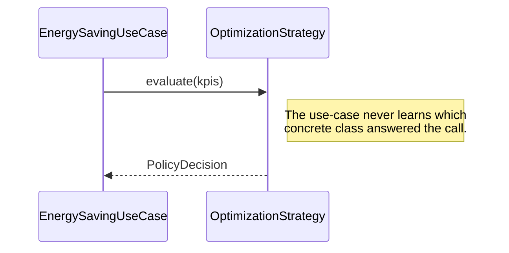

**Quick reference:**

| Principle | Application in the lab |
| --- | --- |
| **Encapsulation** | Group related data and methods; use private (`_`) / protected access; validate in setters |
| **Abstraction** | Use ABCs or `Protocol` for any component with more than one implementation |
| **Inheritance** | Class hierarchies (e.g. `BaseRApp` → `EnergySavingRApp`) for shared plumbing |
| **Polymorphism** | Overridable methods for vendor-specific or platform-specific behavior |

---

## 3. Design Patterns

**Why patterns.** A design pattern is a proven, named solution to a problem that recurs in software. Using them gives you two things: a solution you do not have to reinvent, and a shared vocabulary — when you say "that's an Adapter," every reviewer knows the shape of your code. In this lab the three patterns below exist for one overarching reason: **they keep your research contribution (the algorithm) cleanly separated from the integration plumbing (O-RAN interfaces, vendors, platforms), so the next student can extend one without breaking the other.**

Three patterns are **required** for all rApp / xApp projects. Reference: [Refactoring.Guru — Design Patterns](https://refactoring.guru/design-patterns/).

> [!NOTE]
> Each pattern below is shown twice: first its **canonical structure** (the shape you will find on Refactoring.Guru, redrawn in Mermaid), then the **same shape filled in with lab classes**. Learn to see the second as an instance of the first — that is the skill the pattern vocabulary buys you. The Python examples are adapted from the [Refactoring.Guru example code](https://github.com/RefactoringGuru/design-patterns-python) (MIT licence) into our rApp domain.

**How the three work together.** They are not three unrelated rules; they divide one rApp into three replaceable parts. The factory decides *which world you are in*, the adapters translate *what that world says*, and the strategy is *your research*:

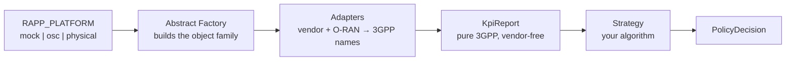

Only the **Strategy** box is your thesis contribution. The other boxes exist so that box never has to change when the testbed does.

### 3.1 Adapter Pattern

Reference: [Adapter Pattern](https://refactoring.guru/design-patterns/adapter)

**The problem.** Every vendor and simulator reports metrics with different names and units — `dl_prb_usage_pct`, `PrbUsedDl`, `prb.util.downlink`. If those proprietary names leak into your algorithm, the algorithm breaks the moment you switch vendor, and results cannot be compared across testbeds.

**The pattern.** An Adapter sits at the boundary and translates a foreign interface into the one your core expects — here, into `ThreeGPPKpi` identifiers. The rApp core never sees a vendor-specific name.

**When to use:**
- Converting proprietary gNB / WiFi AP metrics → `ThreeGPPKpi` identifiers
- Converting O-RAN YANG keys → BMW Lab internal types (`KpiReport`, `PolicyDecision`)

**Canonical structure.** The client wants `ClientInterface`; the `Service` it must actually call has an incompatible interface it cannot change (a vendor's northbound API). The `Adapter` implements the interface the client wants and forwards to the service, translating on the way:

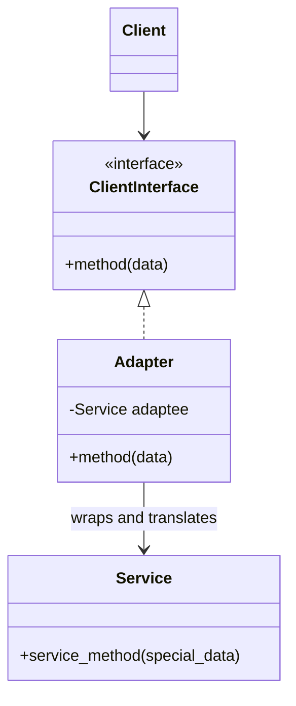

**The same shape in the lab.** `ClientInterface` becomes `VendorTelemetryClient`, and each vendor's API is a `Service` we are not allowed to modify:

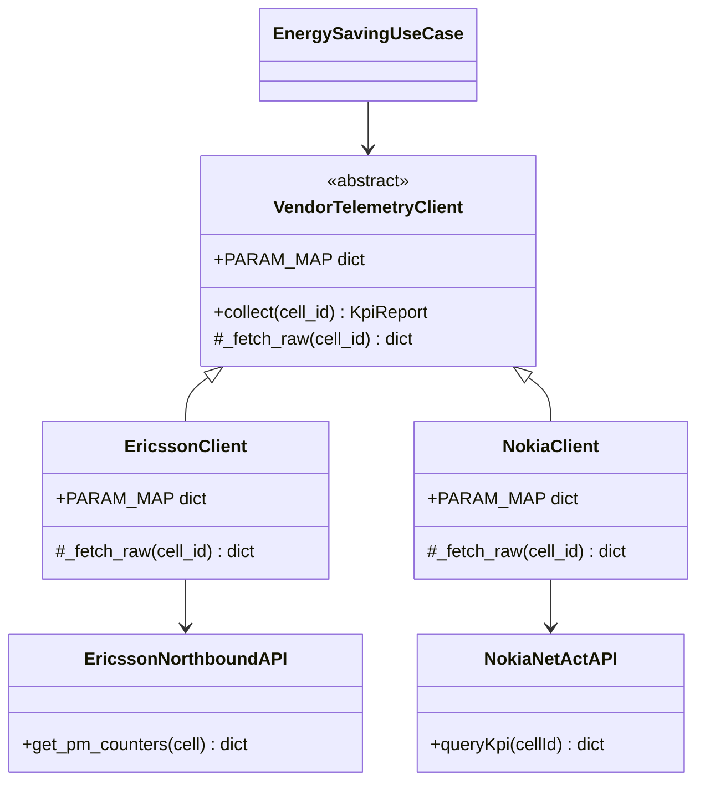

**Example (vendor adapter):**

```python
from abc import ABC, abstractmethod
from typing import ClassVar

class VendorTelemetryClient(ABC):
    """Target interface — the only telemetry surface the rApp core may see."""

    PARAM_MAP: ClassVar[dict[str, ThreeGPPKpi]] = {}

    @abstractmethod
    def _fetch_raw(self, cell_id: str) -> dict[str, float]:
        """Call the vendor API. Returns proprietary keys and units."""

    def collect(self, cell_id: str) -> KpiReport:
        raw = self._fetch_raw(cell_id)               # {"dl_prb_usage_pct": 62.0, ...}
        standard = VendorParameterMap.raw_to_standard(raw, self.PARAM_MAP)
        return KpiReport.from_3gpp(standard)         # {ThreeGPPKpi.DRB_PRB_UTIL_DL: 0.62, ...}

class EricssonClient(VendorTelemetryClient):
    PARAM_MAP: ClassVar[dict[str, ThreeGPPKpi]] = {
        "dl_prb_usage_pct": ThreeGPPKpi.DRB_PRB_UTIL_DL,
        "ul_prb_usage_pct": ThreeGPPKpi.DRB_PRB_UTIL_UL,
        "active_ue_count":  ThreeGPPKpi.RRC_CONN_MEAN,
    }

    def __init__(self, api: EricssonNorthboundAPI) -> None:
        self._api = api

    def _fetch_raw(self, cell_id: str) -> dict[str, float]:
        return self._api.get_pm_counters(cell_id)

class NokiaClient(VendorTelemetryClient):
    PARAM_MAP: ClassVar[dict[str, ThreeGPPKpi]] = {
        "PrbUsedDl": ThreeGPPKpi.DRB_PRB_UTIL_DL,
        "PrbUsedUl": ThreeGPPKpi.DRB_PRB_UTIL_UL,
        "RrcConnUe": ThreeGPPKpi.RRC_CONN_MEAN,
    }

    def __init__(self, api: NokiaNetActAPI) -> None:
        self._api = api

    def _fetch_raw(self, cell_id: str) -> dict[str, float]:
        return self._api.queryKpi(cellId=cell_id)
```

The use-case that consumes them cannot tell the difference, because both return a `KpiReport`:

```python
def run(collector: VendorTelemetryClient, strategy: OptimizationStrategy, cell_id: str):
    return strategy.evaluate(collector.collect(cell_id))
```

**Payoff.** Supporting a new vendor is adding one adapter subclass with its `PARAM_MAP`; the algorithm is untouched, and every algorithm keeps speaking pure 3GPP.

### 3.2 Abstract Factory Pattern

Reference: [Abstract Factory Pattern](https://refactoring.guru/design-patterns/abstract-factory)

**The problem.** The same rApp must run in several environments — a developer laptop (mock), a simulator driven by the TA rApp (osc), and a real gNB testbed (physical). If `if platform == …` checks are scattered across the code, every environment change touches many files and unit tests need real hardware.

**The pattern.** One factory per environment builds the whole **family** of collaborating objects (scenario runner, telemetry collector, KPI analyzer). A single `RAPP_PLATFORM` switch selects the family; the core only ever talks to the abstract factory.

**Deployment environments (select via `RAPP_PLATFORM`):**

| `RAPP_PLATFORM` | Factory | Use when |
| --- | --- | --- |
| `mock` | `MockPlatformFactory` | Unit tests, demos, developer laptop |
| `osc` | `OscPlatformFactory` | Production OSC or simulation via BMW Lab TA rApp |
| `physical` | `PhysicalPlatformFactory` | Real gNB testbed |

> [!IMPORTANT]
> **Simulation rule:** Simulator lifecycle (start/stop VIAVI RSG or ns-3 scenarios,
> configure UE mobility) is the BMW Lab TA rApp's responsibility.
> The generic rApp / xApp uses `RAPP_PLATFORM=osc` pointed at the simulator's
> O-RAN interfaces — it never calls simulator APIs directly.
> TA rApp: <https://github.com/bmw-ece-ntust/nonrtric-rapp-test-automation>

**Canonical structure.** One abstract factory declares a creation method per product type; each concrete factory returns the variants that belong together. The client holds only the abstract types:

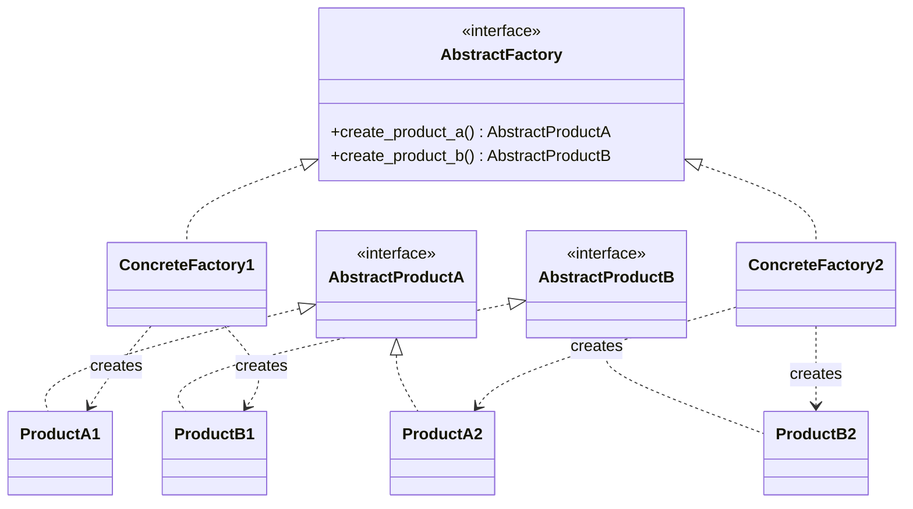

The rule the diagram encodes: `ConcreteFactory1` never creates `ProductB2`. A family is consistent — a mock collector is never paired with a physical scenario runner.

**The same shape in the lab:**

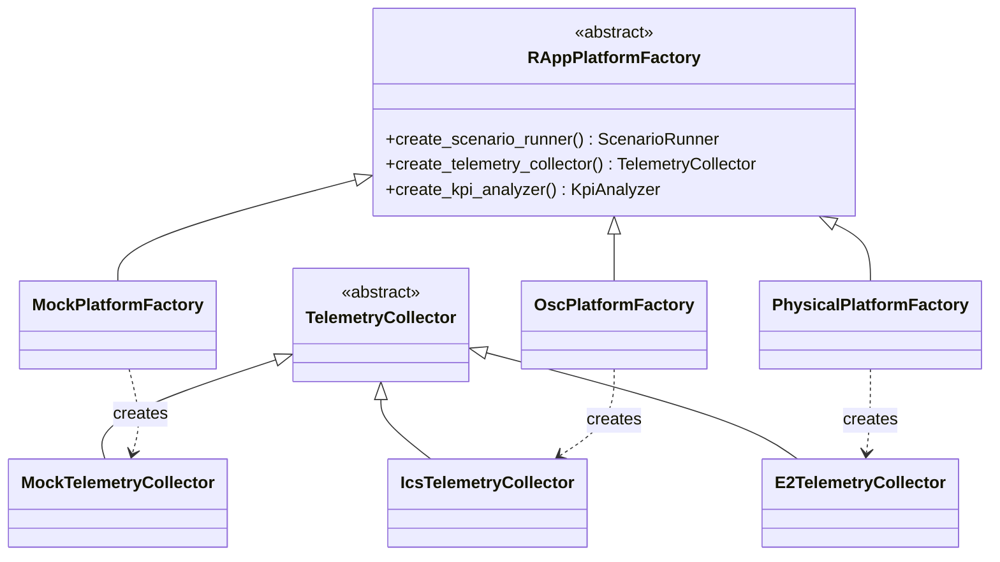

**Example:**

```python
class RAppPlatformFactory(ABC):
    """Creates one consistent family of collaborating objects."""

    @abstractmethod
    def create_scenario_runner(self) -> ScenarioRunner: ...
    @abstractmethod
    def create_telemetry_collector(self) -> TelemetryCollector: ...
    @abstractmethod
    def create_kpi_analyzer(self) -> KpiAnalyzer: ...

class MockPlatformFactory(RAppPlatformFactory):
    def create_scenario_runner(self) -> ScenarioRunner:
        return ReplayScenarioRunner(trace="tests/data/urban_peak.csv")
    def create_telemetry_collector(self) -> TelemetryCollector:
        return MockTelemetryCollector()
    def create_kpi_analyzer(self) -> KpiAnalyzer:
        return KpiAnalyzer(smoothing=None)

class OscPlatformFactory(RAppPlatformFactory):
    def create_scenario_runner(self) -> ScenarioRunner:
        return TaRAppScenarioRunner(base_url=settings.ta_rapp_url)   # never the simulator API
    def create_telemetry_collector(self) -> TelemetryCollector:
        return IcsTelemetryCollector(ics_url=settings.ics_url)
    def create_kpi_analyzer(self) -> KpiAnalyzer:
        return KpiAnalyzer(smoothing="ewma")
```

Selection happens exactly once, at start-up — this is the only place in the codebase that is allowed to know which platform is live:

```python
FACTORIES: dict[str, type[RAppPlatformFactory]] = {
    "mock": MockPlatformFactory,
    "osc": OscPlatformFactory,
    "physical": PhysicalPlatformFactory,
}

def build_factory() -> RAppPlatformFactory:
    return FACTORIES[settings.rapp_platform]()      # RAPP_PLATFORM env var
```

**Payoff.** A new environment is a new factory; your entire test suite runs on `mock` with no hardware, and the core logic never changes between laptop and testbed.

### 3.3 Strategy Pattern

Reference: [Strategy Pattern](https://refactoring.guru/design-patterns/strategy)

**The problem.** In most theses the **algorithm is the research contribution** — a threshold rule, an ML model, an NVIDIA NIM inference backend. You must be able to swap and compare algorithms without touching the rApp framework around them, or your results will not be comparable and your framework will rot with `if`-branches.

**The pattern.** Encapsulate each algorithm behind a common interface — `evaluate(kpis) -> PolicyDecision` — and inject the chosen one. The framework calls `evaluate`; which algorithm runs is a runtime choice.

**When to use:**
- Swapping ML models, threshold rules, or NVIDIA NIM inference backends
- Comparing energy-saving algorithms for your thesis

**Canonical structure.** A `Context` holds a reference to a `Strategy` and delegates the work to it, instead of implementing the algorithm itself:

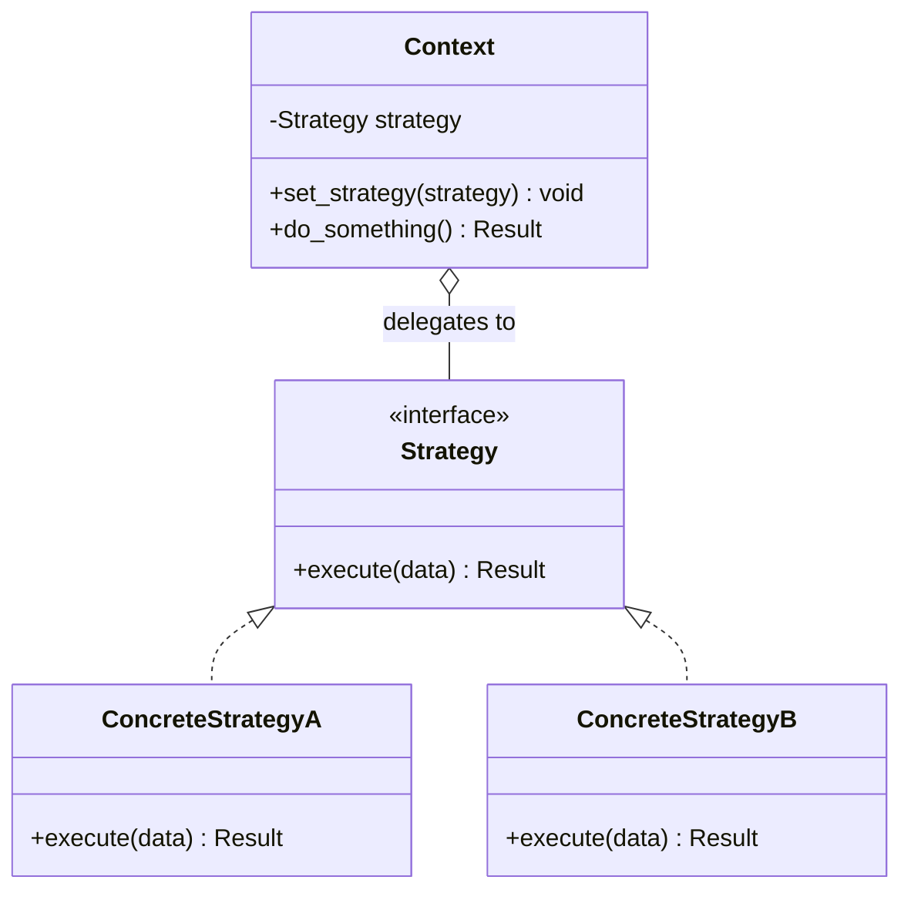

**The same shape in the lab.** The `Context` is your rApp use-case; the strategies are the algorithms you compare in your evaluation chapter:

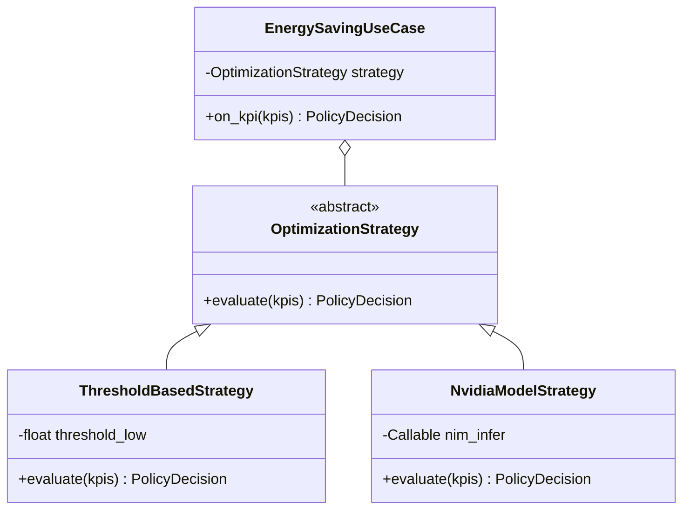

**Example:**

```python
class OptimizationStrategy(ABC):
    @abstractmethod
    def evaluate(self, kpis: KpiReport) -> PolicyDecision: ...

class ThresholdBasedStrategy(OptimizationStrategy):
    def __init__(self, threshold_low: float) -> None:
        self.threshold_low = threshold_low

    def evaluate(self, kpis: KpiReport) -> PolicyDecision:
        return PolicyDecision.SLEEP if kpis.prb_util_dl < self.threshold_low else PolicyDecision.ACTIVE

class NvidiaModelStrategy(OptimizationStrategy):
    def __init__(self, nim_infer: Callable[[KpiReport], str]) -> None:
        self._nim_infer = nim_infer

    def evaluate(self, kpis: KpiReport) -> PolicyDecision:
        return PolicyDecision(self._nim_infer(kpis))
```

The use-case is the context. It is injected with a strategy and never names one:

```python
class EnergySavingUseCase:
    def __init__(self, strategy: OptimizationStrategy) -> None:
        self._strategy = strategy

    def on_kpi(self, kpis: KpiReport) -> PolicyDecision:
        return self._strategy.evaluate(kpis)     # which algorithm? not this class's business
```

Which makes the evaluation chapter of your thesis a loop rather than a branch:

```python
for name, strategy in {
    "baseline-threshold": ThresholdBasedStrategy(threshold_low=0.2),
    "proposed-nim":       NvidiaModelStrategy(nim_infer=nim.infer),
}.items():
    results[name] = simulate(EnergySavingUseCase(strategy), trace)
```

**Payoff.** Comparing algorithms for your evaluation chapter is swapping one object; the plumbing is fixed, so the comparison is fair and the framework stays clean.

### 3.4 Which Pattern Solves Which Problem

When you are unsure which pattern applies, start from the symptom in your code:

| Symptom you see | Pattern | What replaces it |
| --- | --- | --- |
| A vendor's metric name (`PrbUsedDl`) appears inside your algorithm | **Adapter** | Translation at the boundary; the core sees only `ThreeGPPKpi` |
| `if platform == "mock": … elif platform == "physical": …` repeated in several files | **Abstract Factory** | One factory per environment, selected once at start-up |
| `if algorithm == "threshold": … elif algorithm == "ml": …` inside the rApp loop | **Strategy** | One class per algorithm, injected into the use-case |

> [!TIP]
> All three answer the same question — *"what varies here, and can I add a case without editing existing code?"* If adding a vendor, an environment, or an algorithm forces you to **edit** a file rather than **add** one, the pattern is missing or misapplied.

---

## 4. Code Documentation (Sphinx / Doxygen)

**Why it matters.** A docstring is the contract the *next* student reads before they trust your function — it states inputs, outputs, and failure modes so they do not have to reverse-engineer the body. Because Sphinx (Python) and Doxygen (C/C++) generate the API reference directly from these docstrings, documentation that lives beside the code cannot drift out of date the way a separate wiki does. Linking each parameter to its spec section makes every claim in your thesis independently verifiable.

Every class and function must have a docstring auto-generatable by Sphinx (Python) or Doxygen (C/C++).

**Python — Sphinx/RST format:**

```python
def monitor_traffic_load(self, cell_id: str, interval_ms: int = 100) -> KpiReport:
    """Monitor real-time traffic load via E2 KPM.

    :param cell_id: NR Cell Global ID.
    :param interval_ms: KPM report interval in milliseconds (TS 28.552 §5.1.1.12.1).
    :return: :class:`~core.models.KpiReport` with current PM counters.
    :raises E2Error: If the E2 subscription fails.
    """
```

**C++ — Doxygen format:**

```cpp
/**
 * @brief Send RIC Control Request to activate a cell.
 * @param cell_id Target NR Cell Global ID.
 * @param timeout Maximum wait in milliseconds.
 * @return true if activated successfully.
 */
bool activateCell(const std::string& cell_id, int timeout = 5000);
```

Generated output goes to `docs/api/` ([Section 5](#5-folder-structure)).

---

## 5. Folder Structure

**Why this layout.** The folder tree *is* the architecture written on disk: `core/` holds your research (algorithms, models) and depends on nothing below it; `factories/` and `adapters/` hold the plumbing that depends on the core, not the other way around. A newcomer navigates by concept — "the algorithm is in `core/strategies/`, the E2 translation is in `adapters/e2/`" — instead of reading every file. Keeping the research separate from the integration is what lets the next student rerun your algorithm against a new testbed.

```text
project-name/
├── src/
│   ├── core/
│   │   ├── models/
│   │   │   ├── __init__.py     KpiReport, PolicyDecision
│   │   │   └── parameters.py   ThreeGPPKpi enum, NodeType enum, VendorParameterMap
│   │   └── strategies/         OptimizationStrategy ABC + implementations
│   ├── factories/              Abstract Factory — deployment environment creators
│   │   ├── mock/
│   │   ├── osc/
│   │   └── physical/
│   └── rapp/
│       ├── adapters/           Adapter pattern — O-RAN + vendor translators
│       │   ├── a1/
│       │   ├── e2/
│       │   ├── o1/
│       │   ├── r1/
│       │   ├── teiv/
│       │   ├── ves/
│       │   └── vendor/
│       ├── application/
│       │   ├── ports.py        Port Protocols (structural typing)
│       │   └── usecases.py
│       ├── config/settings.py  RAPP_* env vars
│       └── domain/
│           ├── intent.py       IBN IntentContract + IntentResolutionService
│           ├── models.py
│           ├── services.py
│           └── topology.py     NetworkTopology + NodeInfo
├── docs/
│   ├── drawio/                 Source .drawio files (version controlled)
│   └── api/                    Generated Sphinx / Doxygen output
├── tests/
├── simulation/                 Scenarios, raw data, figures — see simulation.md
├── config/
│   └── .env.example
├── requirements.txt
├── research.md                 Research documentation (design contract, paper writing)
├── implementation.md           Installation + end-to-end integration guide
└── README.md                   Entry point: prerequisites, implementation.md link, user guide
```

> [!WARNING]
> Store `.drawio` source files in `docs/drawio/`.  Export PNG/SVG for embedding
> in documentation; always commit the source file for future updates.

### 5.1 One Class per File

**Rule.** Every Python module (`.py` file) defines **at most one top-level class** — one data model, one controller, one adapter, one strategy, one enum, or one exception. The module is named after its class in `snake_case` (`kpi_report.py` ↔ `KpiReport`); inside a package whose name already carries the prefix, drop the redundant part (`e2/sm_kpm_adapter.py` ↔ `E2SmKpmAdapter`, not `e2/e2_sm_kpm_adapter.py`).

**Why.** The file tree becomes the class diagram written on disk: one diagram box = one file, so a reviewer finds any class by filename alone. It enforces single responsibility at the file level, keeps diffs small (two students editing two classes never touch the same file), and makes a class's dependencies visible in its own import block instead of being buried in a 500-line module.

**How to group related classes.** Classes that used to share a module become a **package**: one module per class, plus an `__init__.py` that only re-exports the public API. The `__init__.py` defines no classes — call sites keep importing from the package exactly as they imported from the old module:

```text
models/kpi.py                          models/kpi/
    class PolicyDecision      ──▶          __init__.py        (re-exports only)
    class KpiReport                        policy_decision.py (class PolicyDecision)
                                           kpi_report.py      (class KpiReport)
```

```python
# models/kpi/__init__.py — re-exports only, never class definitions
from models.kpi.kpi_report import KpiReport
from models.kpi.policy_decision import PolicyDecision

__all__ = ["KpiReport", "PolicyDecision"]

# call sites are unchanged:
from models.kpi import KpiReport, PolicyDecision
```

**Boundaries of the rule.**

- Module-level **constants and functions** are not classes; a selector function or a translation-table constant lives beside the class it serves (e.g. a `selector.py` holding `make_strategy()`).
- A **nested class** (defined inside a function or another class) is an implementation detail, not a top-level class — allowed.
- An `Enum` **is** a class and gets its own file. This pairs with [§8](#8-3gpp-parameter-enumeration): every parameter enum is one auditable, spec-traceable file.
- Exception classes follow the same rule — one per file (`error.py` inside the package that raises it).

---

## 6. General Architecture

**Why the dependency direction matters.** Read the arrows below as "depends on." The algorithm (`OptimizationStrategy`, `KpiReport`) sits in the middle and depends on **nothing** vendor- or platform-specific; the adapters and ports depend inward on it. This is what lets you replace an adapter, a vendor, or a whole platform without recompiling your research. Build the core first, then wrap adapters around it.

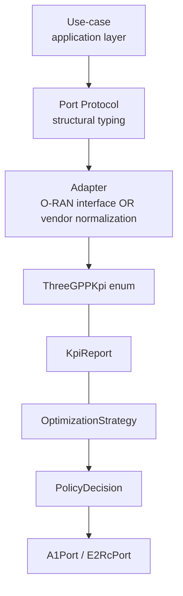

> [!TIP]
> Design core logic first (Strategy + KpiReport), then build adapters around it.
> The research contribution (the algorithm) stays cleanly separated from
> integration plumbing.

---

## 7. O-RAN Protocol Rules

> [!IMPORTANT]
> These rules are mandatory for all rApp / xApp code in BMW Lab.

1. **O-RAN protocols only.** rApps and xApps communicate exclusively through
   O-RAN ALLIANCE standard interfaces: O1, A1, R1 (SME/ICS), and E2.
   No direct calls to simulator APIs (VIAVI RSG, ns-3, UERANSIM).

2. **No InfluxDB bypass.** Telemetry arrives via ICS subscription.
   InfluxDB is an internal SMO storage layer — the rApp never queries it directly.

3. **VES events via ICS.** O1 VES events (PM reports, fault notifications)
   are received through the ICS push callback, not by polling the VES Collector.

4. **Factory = deployment environment.** `RAPP_PLATFORM=mock` for tests,
   `osc` for simulation (via TA rApp) and production.

5. **Simulation via TA rApp.** All simulator lifecycle (start/stop scenarios,
   UE mobility, gNB config) is the BMW Lab TA rApp's responsibility.
   The rApp uses `osc` platform pointed at the simulator's O-RAN interfaces.

---

## 8. 3GPP Parameter Enumeration

**Why an enum, not strings.** A raw string like `"DRB.PrbUtilDL"` misspelled anywhere fails silently at runtime and cannot be found by your IDE. A `ThreeGPPKpi` enum member is checked once, autocompleted everywhere, and carries its spec reference in one place — so a rename is a single edit, not a repo-wide search.

Use the `ThreeGPPKpi` string enum for all 3GPP counter name references.
Never use raw string literals in business logic.

```python
# Wrong
raw.get("DRB.PrbUtilDL", 0.0)

# Correct
from core.models.parameters import ThreeGPPKpi
raw.get(ThreeGPPKpi.DRB_PRB_UTIL_DL.value, 0.0)
```

`ThreeGPPKpi` members with spec references:

| Enum member | Value | Spec | Section | Page |
| --- | --- | --- | --- | --- |
| `DRB_PRB_UTIL_DL` | `"DRB.PrbUtilDL"` | TS 28.552 | §5.1.1.12.1 | Table 5.1.1.12.1-1, p.47 |
| `DRB_PRB_UTIL_UL` | `"DRB.PrbUtilUL"` | TS 28.552 | §5.1.1.12.2 | Table 5.1.1.12.2-1, p.48 |
| `DRB_UE_THP_DL` | `"DRB.UEThpDL"` | TS 28.552 | §5.1.1.10.1 | Table 5.1.1.10.1-1, p.44 |
| `DRB_UE_THP_UL` | `"DRB.UEThpUL"` | TS 28.552 | §5.1.1.10.2 | Table 5.1.1.10.2-1, p.45 |
| `RRC_CONN_MEAN` | `"RRC.ConnMean"` | TS 28.552 | §5.1.1.1.1 | Table 5.1.1.1.1-1, p.21 |
| `RSRP` | `"RSRP"` | TS 36.214 | §5.1.1 | §5.1.1, p.9 |
| `RSRQ` | `"RSRQ"` | TS 36.214 | §5.1.2 | §5.1.2, p.10 |
| `SINR` | `"SINR"` | TS 36.214 | §5.1.4 | §5.1.4, p.12 |

---

## 9. Multi-vendor Support

Multi-vendor support is implemented through two mechanisms:

**A. Vendor metric normalization (vendor adapter):**
Subclass `VendorTelemetryClient` and declare `PARAM_MAP` mapping proprietary
keys to `ThreeGPPKpi`.  The adapter calls `VendorParameterMap.raw_to_standard()`
to translate.

**B. YANG key override (O1 adapter):**
Subclass `O1SdncAdapter` and override the `_YANG_MAX_UES` class attribute (or add
new vendor-specific YANG keys) without forking the adapter.

**C. WiFi APs:**
Use `NodeType.WIFI_AP` in `NodeInfo`.  Map IEEE 802.11 metrics (RSSI, channel
utilization, association count) to the closest `ThreeGPPKpi` equivalents in
the vendor adapter.  See BMW Lab Aruba project for reference implementation.

**D. Multi-gNB:**
Use `NetworkTopology` to register all cells at startup (via `TEIVAdapter`).
Use-cases iterate `topo.active_cells()` — never hard-code cell IDs.

---

## 10. Intent-Based Networking (IBN)

> [!NOTE]
> IBN support is planned via NVIDIA NeMo / NIM.  Use the stubs below as the
> extension point.

**Contract-based protocol:** Every intent is a cryptographically signed
`IntentContract` (HMAC-SHA256, IETF RFC 9315).  The `IntentResolutionService`
enforces three security checks before resolving:

1. **Whitelist** — only `IntentType` enum values are accepted.
2. **Expiry** — contracts past `expires_at` are rejected.
3. **Signature** — HMAC-SHA256 verified against `RAPP_INTENT_SECRET`.

**Integration pattern:**

```python
# In the ICS callback handler
contract = IntentContract(**payload)
svc = IntentResolutionService(secret_key=settings.intent_secret)
svc.validate(contract)           # raises IntentValidationError if invalid
decision = svc.resolve(contract, kpis)   # implement per use case
```

**NVIDIA NIM integration:**
Place NIM HTTP logic in `src/rapp/adapters/nim/`.
Pass `NimAdapter.infer` to `NvidiaModelStrategy`:

```python
nim = NimAdapter(base_url=..., model_id=..., api_key=os.environ["NVIDIA_API_KEY"])
strategy = NvidiaModelStrategy(nim_infer=nim.infer)
```

---

## 11. Production Readiness

Before handover, all of the following must pass.

### 11.1 Container Images

Document the full registry URL, required credentials, and how to renew an
expired pull token.  Test the pull from a fresh machine.

```bash
docker build -t registry.example.com/project/rapp:latest -f src/Dockerfile .
docker pull registry.example.com/project/rapp:latest   # verify from clean machine
```

### 11.2 Git Submodules

If `.gitmodules` is present, the `README.md` Quick Start section must include:

```bash
git clone --recursive <repo-url>
# or after plain clone:
git submodule update --init --recursive
```

### 11.3 Known Issues

Every repo must include a **Known Issues** table in `README.md`:

| Issue | Severity | Status | Workaround |
| --- | --- | --- | --- |
| \<describe issue\> | ❌ BLOCK / ⚠️ WARN / ℹ️ INFO | Open / Fixed | \<steps\> |

### 11.4 API Endpoint Consistency

Every API endpoint name must be identical in `research.md` diagrams, `README.md`,
and source code.  If renamed during development, add a mapping note.

### 11.5 Secrets and Environment Variables

Document every env var in `config/.env.example`.  Never commit secrets.
Mark expiring credentials with renewal instructions. Full policy:
[credentials-vault.md](./lab-automation/credentials-vault.md).

---

## 12. Standards and Parameter Reference Convention

> [!IMPORTANT]
> Every parameter name in source code, documentation, and diagrams must be
> linked to its authoritative spec with exact section and page number.

### 12.1 Rule

| Context | Required format |
| --- | --- |
| Documentation (CONTEXT.md, guides) | `[DRB.PrbUtilDL](https://…/28552-i50.zip) (TS 28.552 §5.1.1.12.1)` |
| Code docstrings | `:param drb_prb_util_dl: DL PRB utilization (TS 28.552 §5.1.1.12.1, p.47)` |
| System Parameters table | Include **Page/§** column |

### 12.2 Spec Archive URLs

| Series | Archive |
| --- | --- |
| TS 28.xxx (OAM/PM) | <https://www.3gpp.org/ftp/Specs/archive/28_series/> |
| TS 38.xxx (NR radio) | <https://www.3gpp.org/ftp/Specs/archive/38_series/> |
| TS 36.xxx (LTE) | <https://www.3gpp.org/ftp/Specs/archive/36_series/> |
| O-RAN Alliance | <https://specifications.o-ran.org/> |
| IEEE | <https://ieeexplore.ieee.org/> |

Link directly to the ZIP of the version used.  Example:

```text
[DRB.PrbUtilDL](https://www.3gpp.org/ftp/Specs/archive/28_series/28.552/28552-i50.zip)
→ TS 28.552 §5.1.1.12.1, Table 5.1.1.12.1-1 (v18.5.0, p.47)
```

### 12.3 System Parameters Table — Required Columns

| Category | Parameter | Type | Unit | Spec | Spec Section | Page/§ | Description |
| --- | --- | --- | --- | --- | --- | --- | --- |
| E2 KPM Input | [`DRB.PrbUtilDL`](https://www.3gpp.org/ftp/Specs/archive/28_series/28.552/28552-i50.zip) | float | ratio | TS 28.552 | §5.1.1.12.1 | Table 5.1.1.12.1-1, p.47 | DL PRB utilization |
| E2 RC Output | `PolicyDecision` | Enum | — | O-RAN.WG2.A1AP | §8.2 | §8.2, p.31 | ACTIVE / SLEEP / HANDOVER |

The **Page/§** column must cite the exact table, paragraph, or page number in
the spec ZIP so future students and LLMs can verify the parameter definition
without searching the entire document.

---

## 13. Code Quality & Git Hygiene

Baseline hygiene for every thesis and sub-module repository — enforced at the handover review.

- **Language conventions:** PEP 8 (Python), Google Style (C++ / Java). Run the formatter/linter before committing (for example `black`/`ruff`, `clang-format`).
- **Meaningful commits on branches:** one logical change per commit with a descriptive message; use feature/fix branches rather than committing large changes straight to `master`.
- **Keep the tree clean:** remove unused code, dead files, and commented-out blocks before each major commit.
- **Push daily:** push all work before the end of each workday, so progress is never stranded on one machine.
