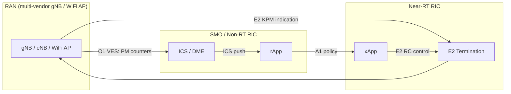
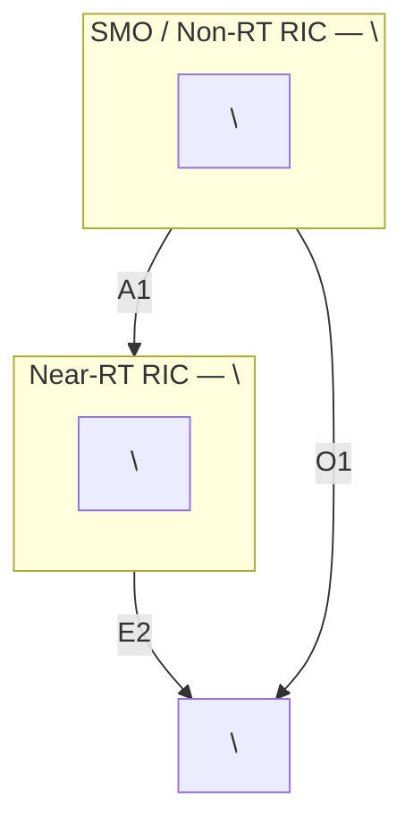
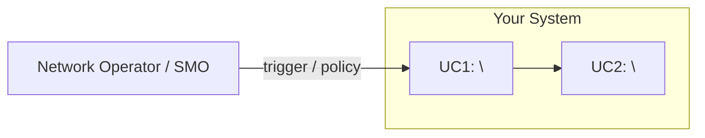
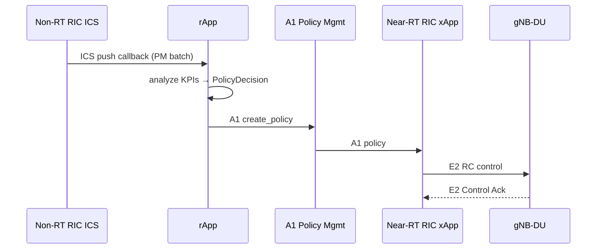
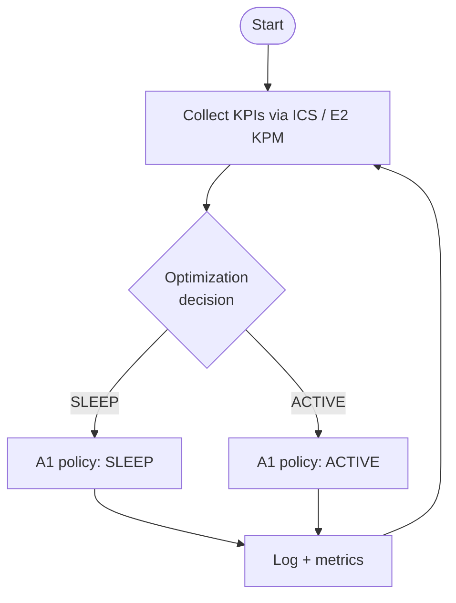
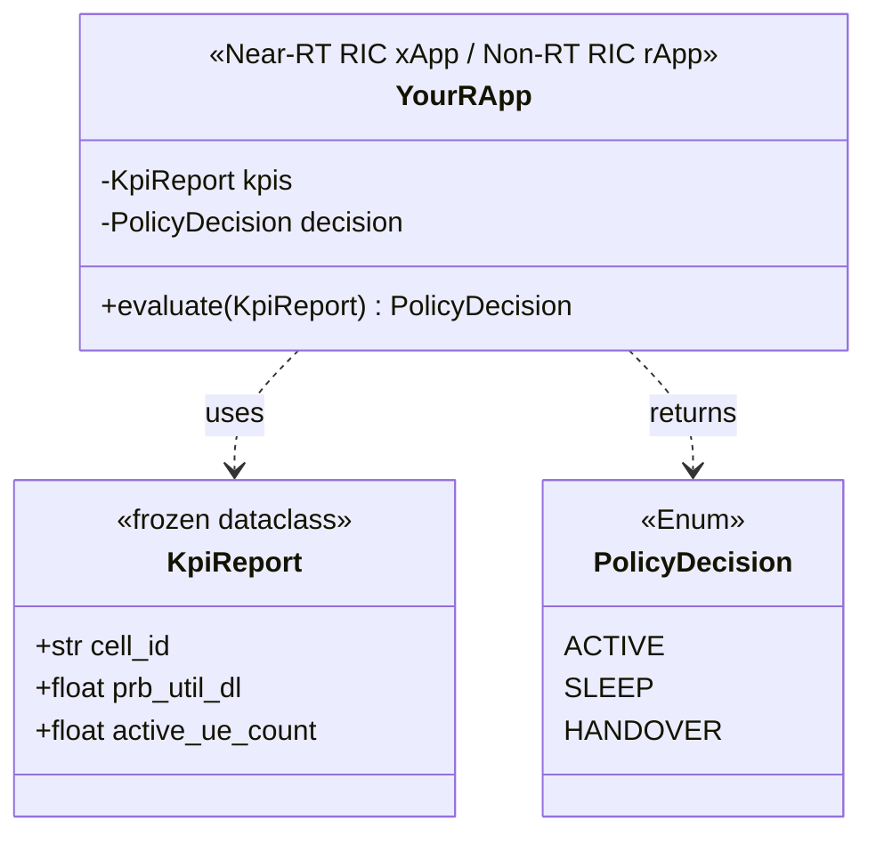

<h1 align="center">Project Documentation — Guideline</h1>

---

> [!WARNING]
> 1. Use this template as the `CONTEXT.md` of your research repository.
>    `README.md` is the user / operator guide (quick start, config, endpoints).
> 2. This template is updated regularly — check before starting a new project.

> [!CAUTION]
> **Confidentiality:** Keep this document `private` by default.
> Publish only after paper acceptance.  Request repo access from the GitHub admin.

> [!IMPORTANT]
> **Human verification of LLM-written documentation.** When any documentation here is
> drafted by an LLM, add a `**Reviewed by**: <GitHub username>` line near the top (under the
> title) to certify that you read it and confirm it is accurate. Documentation still showing
> the `<GitHub username>` placeholder is an unreviewed draft. This mirrors the daily-log and
> meeting-minutes rule — see the SOP [daily-log.md](./daily-log.md).

> [!NOTE]
> **Document roles:**
> - `CONTEXT.md` — Full PRD: architecture, MSC, flowcharts, class diagram, system parameters.  Read every LLM session.
> - `README.md` — User guide: quick start, configuration, endpoints, known issues.
> - `docs/USER-GUIDE.md` — End-user operating instructions.
> - `docs/INSTALLATION-GUIDE.md` — Step-by-step deployment.

---

## Table of Contents

- [Purpose](#purpose)
- [Introduction](#introduction)
- [Execution Status](#execution-status)
- [Minimum Requirements](#minimum-requirements)
- [System Model](#system-model)
- [System Architecture](#system-architecture)
- [O-RAN Interface Compliance](#o-ran-interface-compliance)
- [Use Case Diagram](#use-case-diagram)
- [Message Sequence Chart (MSC)](#message-sequence-chart-msc)
- [Flowchart](#flowchart)
- [Class Diagram](#class-diagram)
- [Multi-vendor Parameter Mapping](#multi-vendor-parameter-mapping)
- [System Parameters](#system-parameters)
- [Evaluation Metrics](#evaluation-metrics)
- [Digital Twin / Simulation Setup](#digital-twin--simulation-setup)
- [Known Issues](#known-issues)
- [References](#references)

---

## Purpose

Describes the research project for thesis / paper writing.  Every detail of
the design must be written here so co-authors can verify results through this
document and the repository.

**Design contract:** The class diagram in this document is the authoritative
design.  Source code class names, attribute names, and method signatures must
match exactly.  Discrepancies require updating the class diagram first.

---

## Introduction

> [!NOTE]
> Define background, importance, contribution, and challenges.
> Structure for academic paper publication.
> Maintain references in a `.bib` file for LaTeX / Pandoc reuse.

1. **Background**: Problem domain and state-of-the-art.
2. **Importance**: Technical and practical impact (KPIs, energy, QoE, automation).
3. **Contribution**: What you implement (rApp/xApp, E2SM type, A1 policy, O1/VES).
4. **Challenges**: Integration (E2/A1/O1), dataset, reproducibility, testbed limits.

---

## Execution Status

> [!NOTE]
> Track implementation progress.  Icons: ✅ done · ⏳ in progress · ❌ failed.

| Step | Status | Timeline | Notes |
| --- | --- | --- | --- |
| Define research scope + baseline | | YYYY-MM-DD | |
| Flowchart + class diagram approved | | YYYY-MM-DD | Required before coding |
| System parameters table complete | | YYYY-MM-DD | All params linked to spec |
| Implement rApp / xApp | | YYYY-MM-DD | |
| Containerize (Docker + Helm) | | YYYY-MM-DD | |
| Simulation experiments (TA rApp) | | YYYY-MM-DD | |
| Real testbed experiments | | YYYY-MM-DD | |
| Paper writing | | YYYY-MM-DD | |

---

## Minimum Requirements

| Component | Requirement |
| --- | --- |
| CPU | \<fill\> |
| RAM | \<fill\> |
| OS | Ubuntu 22.04 LTS |
| Docker | 24.x |
| Kubernetes | 1.28+ |
| SMO / Non-RT RIC | O-RAN SC L Release (or TA rApp sim) |
| Near-RT RIC | \<fill\> |

---

## System Model

> [!NOTE]
> Define the inputs, decision logic, and outputs of the system.
> Use a Mermaid flowchart for AI readability.

---

## System Architecture

> [!NOTE]
> Draw the end-to-end architecture.  For each component provide name, version,
> and a link to its installation guide.
> Use Mermaid for AI readability; export PNG/SVG for papers.
> Store `.drawio` source in `docs/drawio/`.

### Software Versions

| Component | Implementation | Version | Purpose |
| --- | --- | --- | --- |
| SMO / Non-RT RIC | O-RAN SC | \<version\> | |
| Near-RT RIC | \<vendor\> | \<version\> | |
| CU / DU | \<vendor\> | \<version\> | |
| This rApp / xApp | Python / C++ | \<version\> | |
| Docker | Docker Engine | \<version\> | |
| Kubernetes | K8s | \<version\> | |

> [!NOTE]
> **O-RAN naming convention:**
> Alliance releases are alphabetical (L = June 2024, M = Dec 2024).
> O-RAN SC follows the same letter with a date (e.g. L Release = 2024.06).

---

## O-RAN Interface Compliance

> [!NOTE]
> List which O-RAN interfaces your rApp / xApp uses, with spec versions.
> Required for the "Implementation" section of papers.

| Interface | O-RAN Spec | Your adapter / module | Status |
| --- | --- | --- | --- |
| O1 (YANG/NETCONF) | O-RAN.WG5.O1 | \<adapter class\> | \<implemented/stub\> |
| R1/SME | O-RAN WG2 R1-AP | \<adapter class\> | |
| R1/ICS | O-RAN WG2 R1-AP | \<adapter class\> | |
| A1 | O-RAN.WG2.A1AP | \<adapter class\> | |
| E2 SM-KPM | O-RAN.WG3.E2SM-KPM | \<adapter class\> | |
| E2 SM-RC | O-RAN.WG3.E2SM-RC | \<adapter class\> | |

---

## Use Case Diagram

> [!NOTE]
> Define actors and use cases.  Each use case maps to one MSC and one flowchart.

---

## Message Sequence Chart (MSC)

> [!NOTE]
> Show component interactions per use case across O-RAN interfaces.
> MSC = **component communication**.  Flowchart = **algorithm logic**.
> Include interface labels (O1, A1, E2, R1).

### UC1: \<Use Case Name\>

---

## Flowchart

> [!NOTE]
> Show algorithm logic (branches, loops, thresholds) per use case.
> Use diamond shapes for decisions.  Reference threshold values from System Parameters.

### UC1: \<Use Case Name\>

---

## Class Diagram

> [!NOTE]
> Define classes, attributes (3GPP parameter names), and methods.
> Class names here must match source code exactly.
> Follow OOP principles: encapsulation, abstraction, inheritance, polymorphism.
> Add Adapter pattern for each vendor-specific parameter mapping.

---

## Multi-vendor Parameter Mapping

> [!NOTE]
> Document the Adapter pattern translation table for each supported vendor.
> Every proprietary key must map to a `ThreeGPPKpi` enum value with a spec reference.
> This table is the design contract for `VendorParameterMap` in source code.

| Vendor | Proprietary Key | ThreeGPPKpi | Spec | Notes |
| --- | --- | --- | --- | --- |
| Ericsson | `dl_prb_usage_pct` | `DRB.PrbUtilDL` (TS 28.552 §5.1.1.12.1) | ÷ 100 to normalize |
| Nokia | \<vendor key\> | \<3GPP counter\> | | |
| Aruba (WiFi) | `channel_utilization` | `DRB.PrbUtilDL` (closest equivalent) | IEEE 802.11 §9.4.2 |

---

## System Parameters

> [!IMPORTANT]
> Every parameter name must be hyperlinked to its authoritative spec ZIP with
> exact section and page number (SOP source-code-guide Section 8).

| Category | Parameter | Type | Unit | Spec | Spec Section | Page/§ | Description |
| --- | --- | --- | --- | --- | --- | --- | --- |
| E2/ICS Input | [`DRB.PrbUtilDL`](https://www.3gpp.org/ftp/Specs/archive/28_series/28.552/28552-i50.zip) | float | ratio | TS 28.552 | §5.1.1.12.1 | Table 5.1.1.12.1-1, p.47 | DL PRB utilization |
| E2/ICS Input | [`RRC.ConnMean`](https://www.3gpp.org/ftp/Specs/archive/28_series/28.552/28552-i50.zip) | int | count | TS 28.552 | §5.1.1.1.1 | Table 5.1.1.1.1-1, p.21 | Mean connected UEs |
| A1 Output | `PolicyDecision` | Enum | — | O-RAN.WG2.A1AP | §8.2 | §8.2, p.31 | ACTIVE / SLEEP / HANDOVER |
| \<add rows\> | | | | | | | |

---

## Evaluation Metrics

> [!NOTE]
> Define the KPIs used to measure your rApp / xApp performance.
> Separate from input parameters — these are your paper's result metrics.

| Metric | Definition | Unit | Target / Baseline |
| --- | --- | --- | --- |
| Energy saved | Reduction in transmit power when cells sleep | Watts | > X W vs baseline |
| QoS degradation | Max DL throughput drop during cell transitions | % | < Y% |
| Policy latency | Time from KPI trigger to A1 policy enforcement | ms | < Z ms |
| \<add rows\> | | | |

---

## Digital Twin / Simulation Setup

> [!NOTE]
> Document which simulator and which TA rApp configuration was used.
> Required for reproducibility claims in papers.

| Item | Value |
| --- | --- |
| Simulator | VIAVI RSG / ns-3 / ns-O-RAN |
| TA rApp version | \<git SHA or tag\> |
| Test specification file | \<path in TA rApp repo\> |
| Number of cells | \<N\> |
| Number of UEs | \<N\> |
| Simulation duration | \<N\> s |
| Baseline (no rApp/xApp) | Run 1 — TA rApp Phase 1 |
| With rApp/xApp | Run 2 — TA rApp Phase 2 |

---

## Known Issues

> [!WARNING]
> Required section.  Document failure modes a new student will encounter.

| Issue | Severity | Status | Workaround |
| --- | --- | --- | --- |
| \<describe issue\> | ❌ BLOCK / ⚠️ WARN / ℹ️ INFO | Open / Fixed | \<steps\> |

---

## References

> [!NOTE]
> IEEE citation style.  Number in order of first appearance.
> Maintain entries in `references.bib` for LaTeX reuse.
> Pandoc command: `pandoc CONTEXT.md --bibliography=references.bib --citeproc --csl=ieee.csl -o output.pdf`

[1] 3GPP, "Management and orchestration; 5G performance measurements," TS 28.552 V18.5.0, 2024. [Online]. Available: <https://www.3gpp.org/ftp/Specs/archive/28_series/28.552/>

[2] O-RAN Alliance, "O-RAN.WG2.A1AP-v06.00," 2024. [Online]. Available: <https://specifications.o-ran.org/>

[3] O-RAN Alliance, "O-RAN.WG3.E2AP-v03.01," 2024. [Online]. Available: <https://specifications.o-ran.org/>

[4] IETF, "Intent-Based Networking — Concepts and Definitions," RFC 9315, 2022. [Online]. Available: <https://www.rfc-editor.org/rfc/rfc9315>
